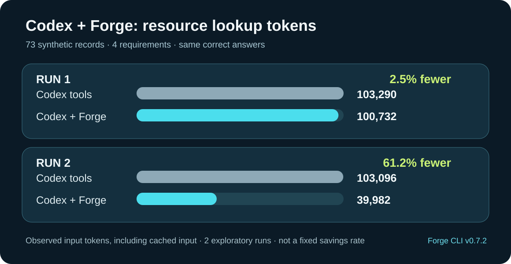

# Forge

English | [简体中文](./README.zh-CN.md)

**A game-resource CLI for AI agents, starting with Godot.**

Codex and other agents use Forge to prepare, diagnose, validate and deliver images, animation frames and audio from creative tools. Forge provides repeatable processing and installation recovery so agents can build games with reliable resources. Developers set the goals and participate in creative review when the task requires it.

[Latest release](https://github.com/MightyKartz/GameSpriteForge/releases/latest) · [Install](#install) · [Features](#what-you-can-do) · [CLI guide](docs/automation/forge-cli.md)


*Created with Codex, prepared and managed with Forge, delivered to Godot. [Watch the replay](docs/media/showcase/thunder/godot-demo.mp4) · [Source sheets and production notes](docs/media/showcase/thunder/README.md).*

## Install

[v0.7.2](https://github.com/MightyKartz/GameSpriteForge/releases/tag/v0.7.2) supports **macOS Apple Silicon** and offers an **experimental Windows x64 portable package**. Install **Godot 4.6.x or 4.7.x** separately for native delivery and preview. Packages are unsigned; the macOS package is not notarized.

Choose one download for your system:

| System | Download |
| --- | --- |
| macOS Apple Silicon | [Online installer](https://github.com/MightyKartz/GameSpriteForge/releases/latest/download/forge-installer.sh) |
| Windows x64 | [Complete installer ZIP](https://github.com/MightyKartz/GameSpriteForge/releases/latest/download/forge-windows-installer.zip) |

Follow the commands below. [Download file guide](docs/releases/downloads.md) explains portable archives, checksums and source attachments.

On macOS:

```bash
curl --proto '=https' --tlsv1.2 -LsSf https://raw.githubusercontent.com/MightyKartz/GameSpriteForge/main/install.sh | sh
```

Open a new terminal, then run:

```bash
forge --version
forge doctor --json
forge guide
```

On Windows, follow the [portable installation guide](docs/releases/windows-portable.md). For an existing game, verify the upgrade before changing its pinned CLI.

Download the single `forge-windows-installer.zip` from the latest release,
extract it, and run the included installer. It discovers and verifies the bundled
archive automatically:

```powershell
Expand-Archive .\forge-windows-installer.zip .\forge-windows
powershell.exe -NoProfile -ExecutionPolicy Bypass -File .\forge-windows\install-windows.ps1
& "$env:LOCALAPPDATA\GameSpriteForge\bin\forge.cmd" doctor --json
```

### Let Codex discover Forge (recommended)

Forge works through its CLI; the bundled `forge-use` skill tells Codex when and
how to use it, so asset tasks route to Forge without naming it. Install the
skill into a game project and commit it — every collaborator's Codex then
discovers it automatically — or install it once for all your local projects:

```sh
forge skill install --project /path/to/game   # commit .agents/skills/forge-use/
forge skill install --user                    # optional: all local projects
```

This works on macOS, Linux and Windows. Run `forge skill check --project .`
after a CLI upgrade; outdated managed skills update with another `install`.
Skill installation is optional: `forge guide` provides the same workflows
offline from the executable itself.

## What you can do

| Workflow | Capabilities |
| --- | --- |
| **Resource library** | Find assets by name or tag, preview media, compare versions, retain reusable files and transfer selected resources between macOS and Windows. |
| **Images** | Batch-process PNG icons and props; configure backgrounds, canvases, anchors and sampling. Generate sets through xAI with your own account when needed. |
| **Animation and layers** | Prepare existing frames or sprite sheets, preserve source coordinates and timing, and package aligned layers with transform and opacity tracks. |
| **Audio** | Import WAV music, sound effects and ambience; trim, adjust gain, add fades and prepare loops. |
| **Godot delivery** | Validate Packs and install native textures, scenes, animations and audio streams. Lock chosen versions, retain delivery receipts and roll back failed updates. |

**Development preview (not in v0.7.2):** a user-installed local ComfyUI can be
called through the same `forge asset create --input request.json --wait --json`
command from Codex, Claude Code or DeepSeek Harness. Forge retains the generated
PNG/MP4, prepares a Pack and resumes Godot delivery after source-bound visual
review. Verified local workflows include Qwen Image 2.1 T2I and single-reference
edit, plus MiniMax H3 I2V and text-to-video source creation. The T2V QA sample
was rejected for a character mismatch and was not installed. Supported modes
depend on the user's API-format workflow, installed weights and explicit profile
mapping. The [development guide](docs/automation/comfyui-local.md) covers
setup, batch budgets, profile portability and limits. Install `forge-use` into
`.agents/skills` for Codex or a
compatible DeepSeek Harness setup, or into `.claude/skills` with
`forge skill install --agent claude-code`. Discovery still requires testing in
each agent client; this source-tree validation does not establish a released
multi-agent workflow.

**New in v0.7.2:** `forge skill install` now works on Windows alongside macOS
and Linux, so every install can let Codex discover Forge — the recommended setup
commits `.agents/skills/forge-use/` into the game repository, giving every
collaborator automatic discovery. v0.7.1 added library vocabulary, metadata-only
search, preview media manifests and requirements reconciliation. Read `forge
guide` from the selected executable. [Release notes](docs/releases/v0.7.2.md)
explain compatibility and validation; real-project productivity remains
unmeasured.

### Codex + Forge: an exploratory token comparison

When Codex needs to find existing game assets, Forge can answer a project-library
requirements query instead of having Codex inspect a full inventory. In two
read-only runs on the same synthetic library of 73 asset records and four requirements,
both approaches returned the correct answers. The Forge-guided runs recorded
**2.5% and 61.2% fewer input tokens**, respectively.



*Input tokens include cached input. Prompts and tool paths varied, and the first
ordinary-tool run hit a local Python path issue. These are observations from a
small synthetic lookup, not a fixed saving, a billing comparison or a measured
real-game productivity gain. [Method, limitations and evidence](docs/qa/codex-token-comparison-v0.7.2.md).*

**Animation previews (v0.6.3):** flat animation Packs can be reviewed from
original PNGs with frame stepping and background selection, or exported on demand
as H.264 MP4. Windows packages include Media Foundation H.264 encoding. Check
`doctor --json` for `pack_mp4_preview`. See the [preview guide](.agents/skills/forge-use/references/animation.md#sharing-a-video-preview)
for commands and timing/transparency limits.

### Audio delivery

Forge prepares local WAV files and delivers native audio resources to Godot. This example plays a synthesized three-note chime in a Godot demonstration scene.


*The GIF is silent. [Watch with sound](docs/media/showcase/v040/native-delivery.mp4) · [Sources and reproduction](docs/media/showcase/v040/README.md).*

### Godot setup and acceptance

Builds with `godot_environment_setup` provide `forge setup godot --path PATH`
(or `--download` for the pinned official engine), persistent machine configuration,
`forge godot lock/check`, and isolated `forge godot verify/export` commands.
Acceptance uses a fresh per-run `user://` profile and resolves relative custom
export templates against the original project without changing its preset.
Read `forge guide godot-workflow` for examples, screenshots, explicit template
installation and native exported-program checks. These commands are included in
v0.5.0; check the selected executable's capabilities. Runtime/screenshot evidence does not establish
visual or gameplay approval. [Workflow guide](.agents/skills/forge-use/references/godot-workflow.md).

## Use with Codex

Forge is most useful for repeated asset processing and updates that need validation
and recovery. For a few ready-to-import PNGs, Godot's native import may be enough.
Project libraries and Provider generation are optional workflows.

Open your game project in Codex and ask:

> Prepare these assets for this Godot project with Forge. Read the pinned CLI's `forge guide`, inspect the previews and diagnostics, and preserve the originals and project locks. Complete processing, installation and native verification within the authorized scope. Ask when intent or authority is missing, and retain any required creative review. Report the result, remaining review needs or recovery steps; keep detailed evidence in files.

The embedded guide works offline. Read a topic with `forge guide project-assets`, `forge guide static`, `forge guide animation`, `forge guide audio` or `forge guide delivery`. An optional [Codex skill installation](docs/automation/forge-cli.md#optional-bundled-codex-skill) enables discovery; see [Let Codex discover Forge](#let-codex-discover-forge-recommended).

## In use: Sword

Sword is a cultivation-themed survival game prototype. Codex created its source artwork; Forge processed and delivered these spell and enemy animations to Godot.


*Existing resources imported with earlier Forge builds, replayed in a dedicated asset showcase. [Source and capture details](docs/media/showcase/README.md).*

## Scope

Current development prioritizes reliable asset delivery and simpler agent usage.
Existing features remain available; wider platform expansion waits for measured
benefits in real projects. See the [product priorities](PRODUCT.md#current-investment-priorities)
and [comparison protocol](docs/qa/asset-delivery-comparison.md).

**New in v0.6.0:** builds with `godot_version_selection` support Godot 4.7.x alongside 4.6.x, with selectable 4.7.2 and 4.6.3 downloads and matching export templates. The new default download is 4.7.2; existing project locks remain unchanged. See the [Godot workflow guide](.agents/skills/forge-use/references/godot-workflow.md).

**New in v0.6.1:** Windows users download a single `forge-windows-installer.zip` containing the verified package, checksum and installer; extraction plus one script installs everything. Capabilities are unchanged from v0.6.0.

**New in v0.6.2:** optional `border_connected` chroma matting protects enclosed details that match the key color, and `edgeColorRecovery` restores soft edge colors from a flat background. Guides now recommend clean transparent RGBA sources and `preserve_alpha` first, with matting as a reviewed fallback.

Character animation remains experimental; advanced character and world-asset commands require optional source-build features. Check `forge doctor --json` for your executable's capabilities.

Music and sound effects are generated in external applications. ACE-Step and Stable Audio 3 have optional read-only source-directory detection; Forge does not install or run their models. Online xAI requests use your own account and may incur charges.

Technical validation does not replace visual review, listening or license checks. Review assets in your game before use. See the [v0.7.2 release notes](docs/releases/v0.7.2.md) for the verified release scope.

## Documentation

- [CLI guide](docs/automation/forge-cli.md) — commands and automation.
- [Resource library](docs/automation/project-asset-library.md) — registration, versions, review and reuse.
- [Local artwork](docs/automation/codex-local-assets.md), [audio](.agents/skills/forge-use/references/audio.md) and [layered Packs](docs/automation/layered-packs.md) — preparation workflows.
- [Example specifications](examples/cli) — starting points for asset requests.
- [Contributing](CONTRIBUTING.md) — source builds and development checks.

## License

[MIT](LICENSE). Bundled FFmpeg tools have separate LGPL notices and source distributions; see [THIRD_PARTY_NOTICES.md](THIRD_PARTY_NOTICES.md).
