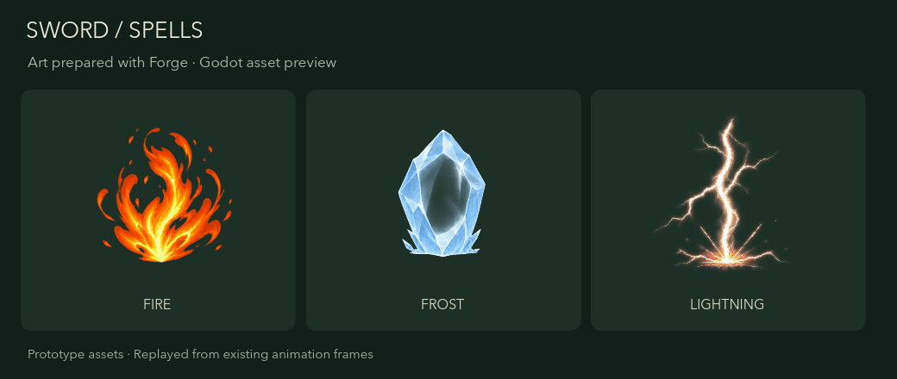
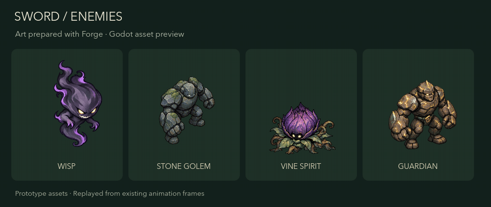

# Forge

[English](./README.md) | 简体中文

**把你的 PNG 图片整理成 Godot 游戏素材。**

Forge 是一款整理 2D 游戏美术素材的 CLI。用 Codex 或你喜欢的图片工具制作美术，将透明 PNG 交给 Forge，再把整理好的素材集交付到游戏项目。你可以直接在终端使用，也可以让 Codex、Claude 配合完成流程。

[最新发布](https://github.com/MightyKartz/GameSpriteForge/releases/latest) ·
[安装](#安装) ·
[CLI 指南](docs/automation/forge-cli.md) ·
[示例](examples/cli)

## 直接配合 Codex 使用

[安装 CLI](#安装)后，在 Codex 中打开游戏项目，可以这样说：

> 请用 Forge 和可用的图像工具，为这个 Godot 游戏制作一组森林主题背包图标。先运行 `forge guide`，保留原图，检查并导入素材。

Codex 使用图像工具制作源图，Forge 负责整理 PNG、打包素材并交付到 Godot。你也可以直接使用已有的透明 PNG。

## 使用你喜欢的工具制作美术

导入 AI 生成的图片、手绘精灵，或你已经拥有的美术素材。每个背包图标、拾取物或场景道具使用一张独立的透明 PNG。本地整理无需 Forge Provider 账号，也无需生成风格设定。


*为本页单独用 AI 生成的森林主题示例素材，随后使用 Forge 处理。*

从 [PNG → Forge → Godot 指南](docs/automation/codex-local-assets.md)开始。

## 为游戏整理一组素材

把透明图标和道具整理到统一画布，选择适合美术风格的纹理采样，并在交付前检查结果。Forge 保留源文件，方便后续修改素材集。对于需要清理背景的图片，也提供背景移除工具。


*从原始图集中切分的一张精灵图，展示 Forge 去除背景前后的实际效果。*

## 将资源交付到 Godot

把静态素材 Pack 交付到 Godot 项目，获得纹理、可直接使用的道具场景，以及放置和渲染设置。在引擎中预览，再根据游戏效果调整大小与行为。

### Sword 项目原型素材预览

这些素材已交付给 Sword 游戏原型：Codex 生成源图，Forge 处理交付，再由 Godot 回放动画。下方预览将已交付的动画帧放进独立展示场景中播放。



*离火、寒霜、落雷。*



*游魂、石傀、妖藤，以及守卫落击动作。*

## 安装

稳定版本为 [v0.3.2](https://github.com/MightyKartz/GameSpriteForge/releases/tag/v0.3.2)，支持 **macOS Apple Silicon**。需要引擎交付时，另行安装 **Godot 4.6.x**。二进制文件尚未签名或公证。已有游戏应先验证升级，再调整固定的 CLI 版本。

```bash
curl --proto '=https' --tlsv1.2 -LsSf https://raw.githubusercontent.com/MightyKartz/GameSpriteForge/main/install.sh | sh
```

重新打开终端，检查安装：

```bash
forge --version
forge doctor --json
forge guide
```

`forge guide` 读取当前 CLI 版本附带的操作指引与请求示例，离线也能使用。

制作第一组素材，请参考[本地 PNG 指南](docs/automation/codex-local-assets.md)，完成透明图片导入、Pack 检查和 Godot 安装。

Forge 也能通过在线服务商生成图标和道具集，详见 [CLI 指南](docs/automation/forge-cli.md)与[示例规格](examples/cli)。在线生成需要使用自己的服务商账号，可能产生费用；本地整理使用你已有的美术素材。

## 开发中的功能

**角色动画目前仍处于测试开发阶段。** 用于游戏前仍需检查实际动画效果。版本的具体范围见 [v0.3.2 发布说明](docs/releases/v0.3.2.md)。

## 文档

- [CLI 指南](docs/automation/forge-cli.md)：命令、素材生成与处理、Godot 交付。
- [PNG 图片工作流](docs/automation/codex-local-assets.md)：整理 Codex 或其他工具制作的 PNG，并交付到 Godot。
- [示例规格](examples/cli)：以现有示例开始制作自己的素材。
- [发布说明](docs/releases/v0.3.2.md)：平台支持和版本范围。
- [展示素材](docs/media/showcase/README.md)：美术来源与 Godot 预览。
- [参与开发](CONTRIBUTING.md)：源码构建与开发检查。

## 许可证

[MIT](LICENSE)。附带 FFmpeg 工具有独立 LGPL 声明和对应源码分发，详见 [THIRD_PARTY_NOTICES.md](THIRD_PARTY_NOTICES.md)。
