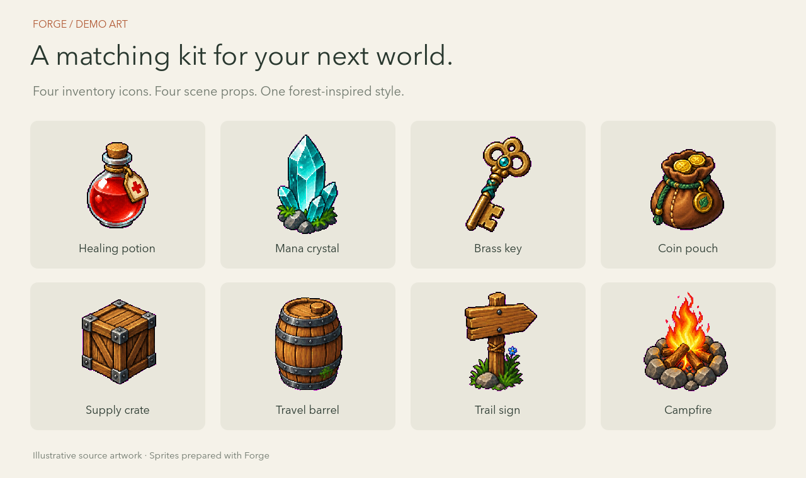
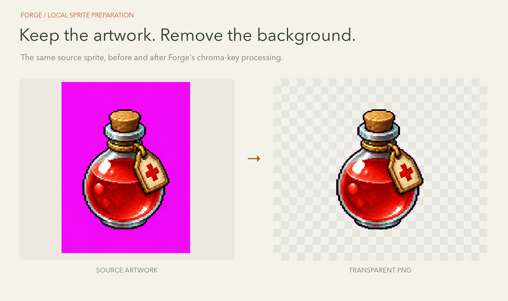
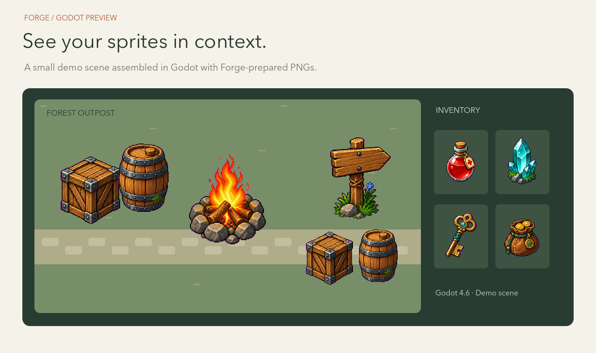

# Forge

[English](./README.md) | 简体中文

**把你的 PNG 图片整理成 Godot 游戏素材。**

Forge 是一款整理 2D 图标和道具的 CLI。用 Codex 或你喜欢的图片工具制作美术，将透明 PNG 交给 Forge，再把整理好的素材集交付到游戏项目。你可以直接在终端使用，也可以让 Codex、Claude 配合完成流程。

[最新发布](https://github.com/MightyKartz/GameSpriteForge/releases/latest) ·
[安装](#安装) ·
[CLI 指南](docs/automation/forge-cli.md) ·
[示例](examples/cli)

## 使用你喜欢的工具制作美术

导入 AI 生成的图片、手绘精灵，或你已经拥有的美术素材。每个背包图标、拾取物或场景道具使用一张独立的透明 PNG。本地整理无需 Forge Provider 账号，也无需生成风格设定。



*为本页单独用 AI 生成的森林主题示例素材，随后使用 Forge 处理。*

从 [PNG → Forge → Godot 指南](docs/automation/codex-local-assets.md)开始。

## 为游戏整理一组素材

把透明图标和道具整理到统一画布，选择适合美术风格的纹理采样，并在交付前检查结果。Forge 保留源文件，方便后续修改素材集。对于需要清理背景的图片，也提供背景移除工具。



*从原始图集中切分的一张精灵图，展示 Forge 去除背景前后的实际效果。*

## 将资源交付到 Godot

把静态素材 Pack 交付到 Godot 项目，获得纹理、可直接使用的道具场景，以及放置和渲染设置。在引擎中预览，再根据游戏效果调整大小与行为。



*使用 Forge 处理后的 PNG，在 Godot 中搭建的演示场景。*

### 按需继续制作

查看任务进度、检查结果，美术有变化时提交更新后的素材集。Forge 支持终端、脚本和编程智能体，既适合处理几张素材，也能重复执行批量任务。

## 安装

稳定版本为 [v0.3.1](https://github.com/MightyKartz/GameSpriteForge/releases/tag/v0.3.1)，支持 **macOS Apple Silicon**。需要引擎交付时，另行安装 **Godot 4.6.x**。二进制文件尚未签名或公证。

```bash
curl --proto '=https' --tlsv1.2 -LsSf https://raw.githubusercontent.com/MightyKartz/GameSpriteForge/main/install.sh | sh
```

重新打开终端，检查安装：

```bash
forge --version
forge doctor --json
```

配合 Codex 使用时，在游戏项目目录执行：

```bash
forge skill install --project .
```

在 Codex 中打开项目，请它使用 `forge-use` 制作游戏素材。CLI 已内置使用指引和示例，无需另外下载源码仓库。个人级安装与更新方式见 [Codex 配置指南](docs/automation/codex-skill.md)。

制作第一组素材，请参考[本地 PNG 指南](docs/automation/codex-local-assets.md)，完成透明图片导入、Pack 检查和 Godot 安装。

Forge 也能通过在线服务商生成图标和道具集，详见 [CLI 指南](docs/automation/forge-cli.md)与[示例规格](examples/cli)。在线生成需要使用自己的服务商账号，可能产生费用；本地整理使用你已有的美术素材。

## 开发中的功能

**角色动画目前仍处于测试开发阶段。** 角色生成、动画复用和多方向动画仍需检查实际画面。实验性的动画复用辅助工具随源码提供，CLI 安装器不包含该工具。

高级角色一致性和世界素材工作流也需要启用可选源码功能。版本的具体范围见 [v0.3.1 发布说明](docs/releases/v0.3.1.md)。

## 文档

- [CLI 指南](docs/automation/forge-cli.md)：命令、素材生成与处理、Godot 交付。
- [PNG 图片工作流](docs/automation/codex-local-assets.md)：整理 Codex 或其他工具制作的 PNG，并交付到 Godot。
- [Codex 配置指南](docs/automation/codex-skill.md)：将内置的 `forge-use` skill 安装到游戏项目。
- [示例规格](examples/cli)：以现有示例开始制作自己的素材。
- [发布说明](docs/releases/v0.3.1.md)：平台支持和版本范围。
- [展示素材](docs/media/showcase/README.md)：图片来源与可复现的 Godot 演示。
- [参与开发](CONTRIBUTING.md)：源码构建与开发检查。

## 许可证

[MIT](LICENSE)。附带 FFmpeg 工具有独立 LGPL 声明和对应源码分发，详见 [THIRD_PARTY_NOTICES.md](THIRD_PARTY_NOTICES.md)。
