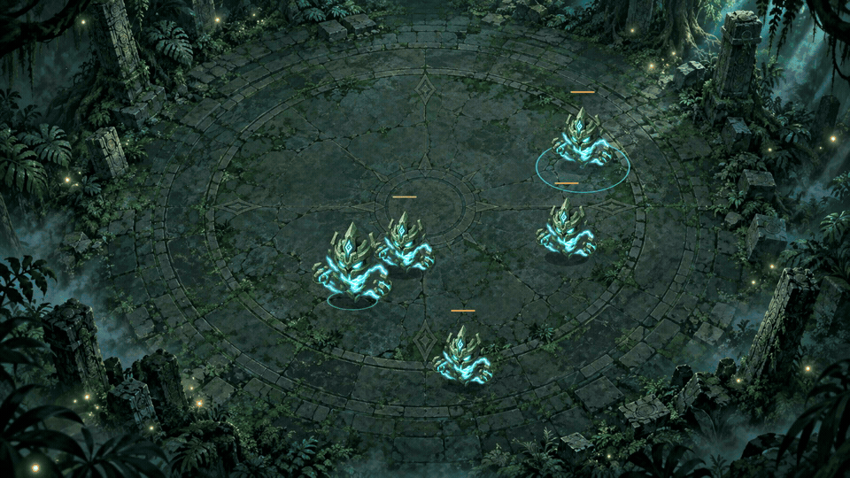
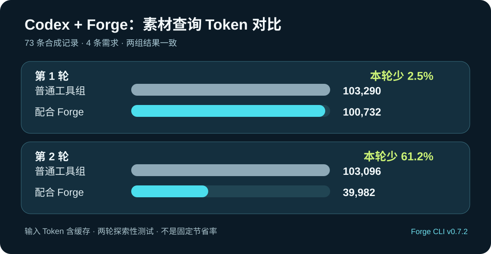
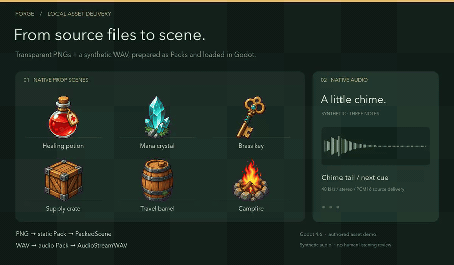

# Forge

[English](./README.md) | 简体中文

**供 AI Agent 使用的游戏资源 CLI，首要支持 Godot。**

Codex 等 Agent 使用 Forge 加工、诊断、验证创作工具提供的图片、动画帧和音频，并交付到游戏引擎。Forge 提供可重复的处理与安装恢复，让 Agent 更可靠地开发游戏。开发者提出目标，并按任务需要参与创意审核。

[最新发布](https://github.com/MightyKartz/GameSpriteForge/releases/latest) · [安装](#安装) · [主要功能](#主要功能) · [CLI 指南](docs/automation/forge-cli.md)



*Codex 创作素材，Forge 加工、管理并交付到 Godot。[观看回放](docs/media/showcase/thunder/godot-demo.mp4) · [原始图集与制作说明](docs/media/showcase/thunder/README.zh-CN.md)。*

## 安装

[v0.7.2](https://github.com/MightyKartz/GameSpriteForge/releases/tag/v0.7.2) 支持 **macOS Apple Silicon**，并提供**实验性 Windows x64 便携包**。需要原生交付和预览时，另行安装 **Godot 4.6.x 或 4.7.x**。安装包尚未签名，macOS 包尚未公证。

按系统选择一个下载文件：

| 系统 | 下载 |
| --- | --- |
| macOS Apple Silicon | [在线安装脚本](https://github.com/MightyKartz/GameSpriteForge/releases/latest/download/forge-installer.sh) |
| Windows x64 | [完整安装 ZIP](https://github.com/MightyKartz/GameSpriteForge/releases/latest/download/forge-windows-installer.zip) |

下载后按下方命令操作。[下载文件说明](docs/releases/downloads.md)介绍便携包、校验文件和源码附件的用途。

macOS 安装：

```bash
curl --proto '=https' --tlsv1.2 -LsSf https://raw.githubusercontent.com/MightyKartz/GameSpriteForge/main/install.sh | sh
```

重新打开终端，然后运行：

```bash
forge --version
forge doctor --json
forge guide
```

Windows 用户请按[便携包安装指南](docs/releases/windows-portable.md)操作。已有游戏应先验证升级，再修改固定的 CLI 版本。

从最新发布页只下载一个 `forge-windows-installer.zip`，解压后运行其中的安装脚本；
脚本会自动读取并校验同目录的完整包：

```powershell
Expand-Archive .\forge-windows-installer.zip .\forge-windows
powershell.exe -NoProfile -ExecutionPolicy Bypass -File .\forge-windows\install-windows.ps1
& "$env:LOCALAPPDATA\GameSpriteForge\bin\forge.cmd" doctor --json
```

### 让 Codex 发现 Forge（推荐）

Forge 通过 CLI 工作；内置的 `forge-use` skill 告诉 Codex 何时以及如何调用它，
素材类任务会自动走 Forge 流程，无需点名。推荐把 skill 安装进游戏项目并提交，
这样团队每个人的 Codex 都会自动发现；也可以为本地所有项目安装一次：

```sh
forge skill install --project /path/to/game   # 提交 .agents/skills/forge-use/
forge skill install --user                    # 可选：本地所有项目
```

macOS、Linux、Windows 均支持。CLI 升级后用 `forge skill check --project .` 检查；
过期的受管 skill 再执行一次 `install` 即可更新。skill 安装是可选项：
`forge guide` 离线提供同样的工作流说明。

## 主要功能

| 工作流 | 可以完成的事情 |
| --- | --- |
| **资源库** | 按名称或标签查找素材，预览、对比版本，保留可复用文件，在 macOS 与 Windows 间转移选定资源。 |
| **图片** | 批量处理 PNG 图标和道具，设置背景、画布、锚点与采样方式；需要时可使用自己的 xAI 账号生成素材集。 |
| **动画与分层** | 加工已有动画帧或精灵图集，保留源坐标和时长，将已配准图层及变换、透明度轨道封装成 Pack。 |
| **音频** | 导入 WAV 音乐、音效和环境声，进行裁剪、增益调整、淡入淡出和循环处理。 |
| **Godot 交付** | 验证 Pack，安装原生纹理、场景、动画和音频资源；锁定选定版本、保留交付回执，并在更新失败时回滚。 |

**开发预览（不包含在 v0.7.2 中）：**本机已安装 ComfyUI 的用户，可让 Codex、
Claude Code 或 DeepSeek Harness 通过同一命令 `forge asset create --input
request.json --wait --json` 发起生成。Forge 保留 PNG/MP4 原件、制作 Pack，
经绑定源哈希的视觉审核后继续交付 Godot。已在本机验证 Qwen Image 2.1
文生图与单参考图编辑、MiniMax H3 首帧生视频和文生视频原件生成。文生视频
测试素材因角色不一致被拒绝，未安装进 Godot；实际可用模式取决于用户的
API 格式工作流、模型权重和显式 profile 映射。配置、批量预算和 profile
迁移见[开发指南](docs/automation/comfyui-local.md)。Codex 或兼容的
DeepSeek Harness 项目可安装 `.agents/skills`，Claude Code 使用
`forge skill install --agent claude-code` 安装到 `.claude/skills`。
还需在各 Agent 对话客户端验证自然语言发现；源码测试不等于已发布的多 Agent 能力。

**v0.7.2 新功能：**`forge skill install` 在 Windows 上与 macOS/Linux 同样可用，每次安装
都可以让 Codex 发现 Forge——推荐把 `.agents/skills/forge-use/` 提交进游戏仓库，团队所有
成员自动获得发现能力。v0.7.1 提供了资源库词表、免核验搜索、预览媒体清单和需求对账。
先读取所选二进制的 `forge guide`；兼容性与验证范围见[发布说明](docs/releases/v0.7.2.md)。
真实项目效率收益尚未完成实测。

### Codex + Forge：探索性 Token 对比

Codex 查找已有游戏素材时，可以让 Forge 回答项目资源库的需求对账，而不必逐项阅读
完整清单。在同一份包含 73 条素材记录、4 条需求的合成素材库上进行了两轮只读对比，
两种方式都得出正确答案。配合 Forge 的两轮分别记录了**少 2.5% 和 61.2% 的输入 Token**。



*输入 Token 包含缓存输入。两轮的提示和工具路径存在差异，第一轮普通工具组还遇到本机
Python 路径问题。这只是合成查询的小样本观测，不代表固定节省率、账单折扣或已验证的
真实游戏开发提效。[查看测试方法、限制与证据](docs/qa/codex-token-comparison-v0.7.2.md)。*

**动画预览（v0.6.3）：** 平面动画 Pack 可直接播放原始 PNG，支持逐帧查看和切换背景，
也可按需导出 H.264 MP4。Windows 包已包含 Media Foundation H.264 编码支持；请通过
`doctor --json` 检查 `pack_mp4_preview` 能力。
命令及时间精度、透明度限制见[预览指南](.agents/skills/forge-use/references/animation.md#sharing-a-video-preview)。

### 音频交付

Forge 将本地 WAV 加工并交付为 Godot 原生音频资源。这个示例在 Godot 演示场景中播放一段合成的三音提示音。



*GIF 本身无声。[观看有声演示](docs/media/showcase/v040/native-delivery.mp4) · [素材来源与复现](docs/media/showcase/v040/README.md)。*

### Godot 配置与验收

具有 `godot_environment_setup` 能力的构建支持 `forge setup godot --path PATH`
（或用 `--download` 下载固定版本的官方引擎）、持久化本机配置、
`forge godot lock/check` 项目版本要求，以及在独立副本中执行的
`forge godot verify/export`。每次验收使用独立的 `user://` 存档环境；自定义导出模板的
相对路径按原项目解析，原预设保持不变。通过 `forge guide godot-workflow` 阅读截图、
显式安装导出模板和启动导出程序的示例。这些命令已包含在 v0.5.0 中，
使用前请检查当前 CLI 的 capabilities。运行通过或生成截图不代表已经完成视觉与玩法验收。
[工作流指南](.agents/skills/forge-use/references/godot-workflow.md)。

## 配合 Codex 使用

Forge 更适合需要验证与恢复的反复加工和素材更新。只有少量已可直接使用的 PNG 时，
Godot 原生导入可能就足够了。项目资源库和 Provider 生成均为可选工作流。

在 Codex 中打开游戏项目并提出需求：

> 请用 Forge 为这个 Godot 项目加工素材。先读取项目固定版本的 `forge guide`，检查预览和诊断，保留原图及项目锁。在已有授权内完成加工、安装和真实引擎验证；意图或权限缺失时再询问，保留任务要求的创意审核。报告结果、待审核项或恢复步骤，详细证据保存在文件里。

内置指南支持离线读取。通过 `forge guide project-assets`、`forge guide static`、`forge guide animation`、`forge guide audio` 或 `forge guide delivery` 查看对应主题。也可选择[安装 Codex skill](docs/automation/forge-cli.md#optional-bundled-codex-skill) 让 Codex 自动发现，见[让 Codex 发现 Forge](#让-codex-发现-forge推荐)。

## 实际项目：Sword

Sword 是一款修仙题材的生存游戏原型。源图由 Codex 创作，Forge 将这些法术和怪物动画加工并交付到 Godot。


*使用早期 Forge 构建导入的已有资源，在独立素材展示场景中回放。详见[来源与录制说明](docs/media/showcase/README.md)。*

## 能力范围

当前开发优先保证素材交付可靠、智能体入口简明。现有功能继续可用，扩大平台范围前先
验证真实项目收益。详见[产品投入重点](PRODUCT.md#current-investment-priorities)和
[对照实验方案](docs/qa/asset-delivery-comparison.md)。

**v0.6.0 新功能：**具有 `godot_version_selection` 能力的构建同时支持 Godot 4.6.x 与 4.7.x，可选择下载 4.6.3 或 4.7.2 及对应导出模板。新的默认下载版本为 4.7.2，已有项目的工具链锁保持不变，详见 [Godot 工作流指南](.agents/skills/forge-use/references/godot-workflow.md)。

**v0.6.1 新功能：**Windows 用户只需下载一个 `forge-windows-installer.zip`，其中包含已校验的完整包、校验和与安装脚本；解压后运行一个脚本即可完成安装。功能能力与 v0.6.0 一致。

**v0.6.2 新功能：**可选的 `border_connected` 抠图只处理与图片边缘连通的背景，保护被主体包围的同色细节；`edgeColorRecovery` 会从平面背景反推柔和边缘颜色。指南现在优先推荐干净透明 RGBA 源图和 `preserve_alpha`，抠图作为审核后的备选方案。

角色动画仍属实验性功能；高级角色及世界资产命令需要启用可选的源码构建功能。使用 `forge doctor --json` 核对当前 CLI 的能力。

音乐和音效由外部应用生成。ACE-Step 和 Stable Audio 3 提供可选的源代码目录只读检测，Forge 不安装或运行其模型。在线 xAI 请求使用你的账号，可能产生费用。

技术检查不能代替美术审查、试听或许可核对，使用前请在游戏中验收。已验证的版本范围见 [v0.7.2 发布说明](docs/releases/v0.7.2.md)。

## 文档

- [CLI 指南](docs/automation/forge-cli.md)：命令与自动化。
- [项目资源库](docs/automation/project-asset-library.md)：登记、版本、审核与复用。
- [本地美术](docs/automation/codex-local-assets.md)、[音频](.agents/skills/forge-use/references/audio.md)和[分层 Pack](docs/automation/layered-packs.md)：素材加工流程。
- [示例规格](examples/cli)：素材请求的起点。
- [参与开发](CONTRIBUTING.md)：源码构建与开发检查。

## 许可证

[MIT](LICENSE)。附带 FFmpeg 工具有独立 LGPL 声明和对应源码分发，详见 [THIRD_PARTY_NOTICES.md](THIRD_PARTY_NOTICES.md)。
