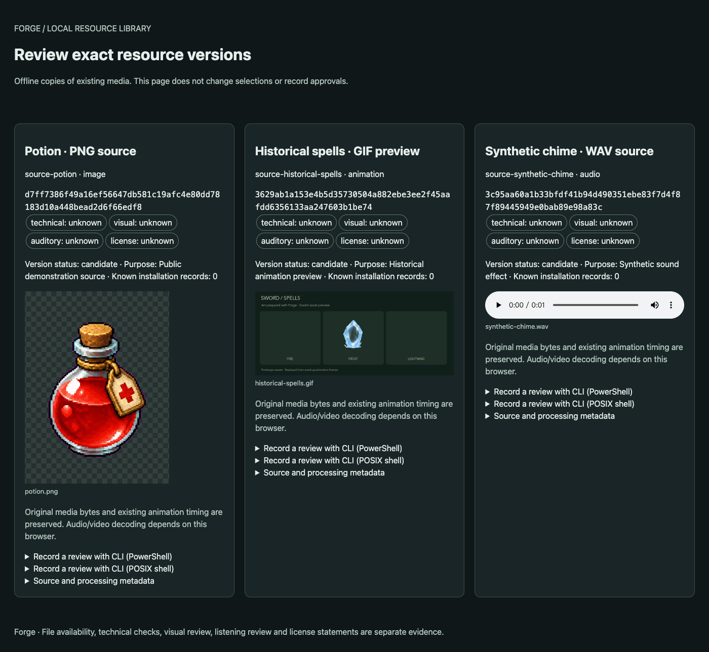
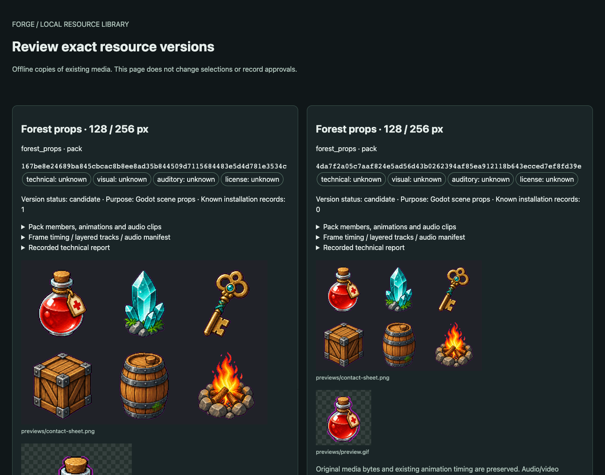

# Forge

[English](./README.md) | 简体中文

**整理、加工、审核 2D 游戏美术与音频，并交付到 Godot。**

Forge 是面向 AI 协作开发的 Rust CLI。接入你喜欢的工具生成的美术和 WAV 音频，将源素材与生成结果保存在项目资源库中，再把选定版本制作成可验证的 Pack 和 Godot 原生资源。Codex、Claude 和脚本都可以通过内置指南与 JSON 输出驱动这套流程。

[最新发布](https://github.com/MightyKartz/GameSpriteForge/releases/latest) · [安装](#安装) · [项目资源库](#统一管理项目资源) · [CLI 指南](docs/automation/forge-cli.md) · [示例](examples/cli)



*由 `forge asset preview` 实际生成的离线页面。资源库关联源素材、历史版本和审核记录。这是 CLI 生成的只读浏览器预览。*

## 安装

[v0.4.0](https://github.com/MightyKartz/GameSpriteForge/releases/tag/v0.4.0) 支持 **macOS Apple Silicon**，并提供**实验性 Windows x64 便携包**。仅在需要引擎原生交付和预览时安装 **Godot 4.6.x**。安装包尚未签名，macOS 包尚未公证。

macOS 安装：

```bash
curl --proto '=https' --tlsv1.2 -LsSf https://raw.githubusercontent.com/MightyKartz/GameSpriteForge/main/install.sh | sh
```

重新打开终端，然后运行：

```bash
forge --version
forge doctor --json
forge guide
```

Windows 用户请从同一 Release 下载 ZIP、校验文件和两个 PowerShell 脚本，按 [Windows 安装指南](docs/releases/windows-portable.md)操作。安装不需要管理员权限，使用安装后的 `forge.cmd` 启动。安装包在原生 Windows CI 上构建并验证。

已有游戏应先验证升级，再修改固定的 CLI 版本。升级 Forge 不会自动更新单独安装的 skill 或游戏的工具链锁。

## 从已有素材开始

创建本地资源库，扫描选定的源文件目录，再登记需要保留的素材：

```bash
forge project init --path ./library --name "Game resources" --local-assets --json
forge asset scan --project ./library --root ./source-media --out intake.json --json
# 检查 intake.json，调整资源 ID、名称、标签和需要登记的条目。
forge asset register --project ./library --input intake.json --json
forge asset search --project ./library --json
forge asset preview --project ./library --out ./preview --json
```

将 `source-media` 换成你的素材目录，每次扫描或预览使用新的输出路径。在本地浏览器打开 `preview/index.html`。这些操作不调用生成服务。登记记录已有文件；制作可交付到游戏的 Pack 是后续独立的加工步骤。

使用 Codex 时，在游戏项目中提出需求：

> 请用 Forge 整理这个游戏的图片、动画和 WAV 音频。先运行 `forge guide`，保留源文件并加工素材，向我展示结果供审核，再把选定版本交付到 Godot。

`forge guide` 随 CLI 内置，离线也能读取。主题包括 `project-assets`、`static`、`animation`、`audio` 和 `delivery`。macOS/Linux 可通过可选的 `forge skill install` 让 Codex 发现 skill；读取指南无需安装 skill。

## 统一管理项目资源

- **查找与复用：** 登记源素材和已完成的产物，按名称、标签或 Pack 成员搜索，查看资源历史。
- **对比与审核：** 预览图片、GIF 及浏览器支持的音视频；对比明确版本，分别保存技术、美术、试听和许可审核意见。
- **保留与选择：** 将原始字节复制到项目存储，选择偏好的版本，为游戏锁定明确的交付版本。
- **跨电脑协作：** 在 macOS 与 Windows 间转移选定资源，重新绑定本地目录、校验内容并协调并行修改的资源目录历史。

新产物不会自动替换游戏已锁定的资源。资源目录元数据与媒体文件分开保存，仅提交目录元数据不会备份或转移媒体。离线画廊用于查看素材和审核记录；审核、选择等修改通过 CLI 完成。

阅读[项目资源库指南](docs/automation/project-asset-library.md)，或运行 `forge guide project-assets`。

<details>
<summary>查看同一道具 Pack 的两个版本</summary>



*相同六张源图分别按 128 px 和 256 px 画布制作。每个版本保留独立的身份和安装历史；示例中的人工审核状态仍为未知。*

</details>

## 加工美术、动画和音频

| 输入 | Forge 的处理 | 交付结果 |
| --- | --- | --- |
| 本地 PNG 图标和道具 | 批量处理、透明边界或显式色键处理、画布设置、居中或落地原点、像素或平滑采样 | 静态 Pack、纹理和可复用道具场景 |
| 已有动画帧或精灵图集 | 提取帧、清理背景、统一画布，可保留源坐标和逐帧时长 | 动画 Pack、`SpriteFrames` 和 `AnimatedSprite2D` 场景 |
| 已配准的 PNG 图层 | 按共享画布封装，支持指定的变换和透明度轨道 | 分层 Pack 和原生播放场景 |
| WAV 音乐、音效和环境声 | 裁剪、显式增益、淡入淡出、循环交叉淡化、采样率和声道转换 | 音频 Pack 和 Godot 原生音频资源 |


*早期本地处理示例。[展示素材说明](docs/media/showcase/README.md)区分了这些中间 PNG 结果与完整的 Pack 交付。*

也可以通过固定风格参考和自己的 xAI 账号，让 Forge 生成图标集、道具集，查看一致性报告并针对选定素材重试。服务商请求可能产生费用。Codex 图像工具创作源图属于独立生成步骤，之后可交给 Forge 本地加工。

音乐和音效由你选择的外部应用生成并导出 WAV。ACE-Step 和 Stable Audio 3 是可选工具，Forge 仅提供**源代码目录的只读检测**，不附带、安装或运行其模型。音频处理通过不代表已经完成试听，也不保证无缝循环。

从 `forge guide static`、`forge guide animation`、`forge guide audio` 或[分层 Pack 指南](docs/automation/layered-packs.md)开始。

## 将选定版本交付到 Godot

Forge 在安装原生资源前验证 Pack 的结构和哈希。安装会记录文件归属和内容基线，检查内容变更，并在交付失败时恢复上一次安装。源文件哈希、处理设置、任务报告和可独立保存的回执共同记录每次交付的依据。


*独立示例场景使用 v0.4.0 新导入的静态和音频资源。本 GIF 无声音，可[观看带合成提示音的录制视频](docs/media/showcase/v040/native-delivery.mp4)，或阅读[复现与来源说明](docs/media/showcase/v040/README.md)。场景布局由演示脚本编排。*

使用 `forge godot plan-install` 和 `forge plan execute`，也可以通过游戏的资源锁安装资源库中的明确版本。运行 `forge godot verify-install` 审计已安装的文件。游戏播放逻辑由你的项目控制。

Pack 有效和原生资源加载成功属于技术检查。美术审查、试听及游戏中的实际表现需要分别验收。详见 `forge guide delivery` 和 [CLI 交付协议](docs/automation/forge-cli.md)。

## 实际项目：Sword

Sword 是一款使用 Forge 处理素材并交付到 Godot 的修仙题材生存游戏原型。下方已有法术和怪物资源的源图由 Codex 生成，曾通过早期 Forge 构建导入。


*历史资源在独立的 Godot 素材展示场景中回放，保留原来的帧序和时长。这些是原型素材示例，范围见[来源与录制说明](docs/media/showcase/README.md)。*

## 当前能力范围

本地静态素材处理、资源库、WAV 处理、Pack 验证和 Godot 交付已包含在 v0.4.0 默认发行版中。**角色动画仍属实验性功能**，包括生成和多方向工作流。高级角色及世界资产命令仍是可选的源码构建功能。Windows 发行包处于实验阶段。

Forge 记录针对明确版本的审核意见，不判定第三方许可权利，也不会自动批准后续版本。通过 `forge doctor --json` 核对所用 CLI 的构建身份与能力。[发布说明](docs/releases/v0.4.0.md)记录了平台支持及验证范围。

## 文档

- [CLI 指南](docs/automation/forge-cli.md)：命令与自动化协议。
- [项目资源库](docs/automation/project-asset-library.md)：登记、版本、审核、保留和交付。
- [本地美术工作流](docs/automation/codex-local-assets.md)：从源图加工到 Godot。
- [音频工作流](.agents/skills/forge-use/references/audio.md)：本地 WAV 处理与原生交付。
- [示例规格](examples/cli)：素材请求的起点。
- [展示素材来源](docs/media/showcase/README.md)：媒体来源与复现方法。
- [参与开发](CONTRIBUTING.md)：源码构建与开发检查。

## 许可证

[MIT](LICENSE)。附带 FFmpeg 工具有独立 LGPL 声明和对应源码分发，详见 [THIRD_PARTY_NOTICES.md](THIRD_PARTY_NOTICES.md)。
