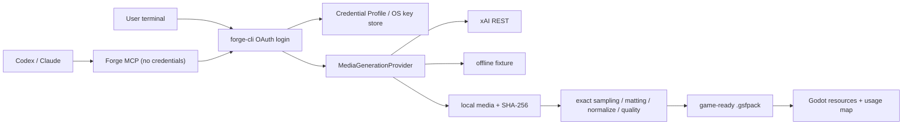

# Forge model-neutral media generation architecture

## Decision

Forge owns the asset pipeline and treats generative models as replaceable media sources. Grok Build CLI is not a runtime dependency. Character Pack processing, matting, exact video sampling, normalization, quality gates, `.gsfpack` export, and engine installation stay in Core.

## Stable boundaries

- `forge_core::provider` defines requests, media results, tickets, polling, capabilities, usage, and typed errors.
- `forge_providers` owns credential profiles and concrete network Providers.
- `CredentialProvider` is independent of `MediaGenerationProvider`; OAuth and API Key supply the same Bearer interface.
- Provider output is untrusted until it is a regular local file below the job's Provider directory, within the size limit, format-valid, and SHA-256 hashed.
- A schema V3 job locks one `providerId` and `profileId`. No retry path may silently change Provider or model.
- Tokens, device codes, authorization headers, and temporary signed URLs are absent from plan JSON, JobStore records, packs, MCP responses, and normal logs.

## Schema V3 top-down contract

The first generated workflow is `topdown@1.0.0`: `idle`, `walk_up`, `walk_right`, and `walk_down`. `walk_left` is intentionally omitted and mapped to horizontally flipped `walk_right` at engine handoff. Each action receives no more than two attempts across Provider failure and quality regeneration. The pack exporter remains blocked until every required action is `game_ready`.

## Authentication posture

xAI Device Code OAuth uses OIDC Discovery at `auth.x.ai`, the Preview shared client ID, and the scopes `openid profile email offline_access grok-cli:access api:access`. Discovered authorization and token URLs must be HTTPS on `x.ai` or a subdomain. Access tokens refresh one hour early. Rotating Refresh Tokens are saved atomically; ambiguous transport failures are not blindly retried.

The stable commercial alternative is `XAI_API_KEY`. The shared OAuth client remains Preview until xAI approves Forge's distribution. `FORGE_XAI_OAUTH_CLIENT_ID` lets an approved build replace the Preview client without changing Core or the media Provider.

The REST implementation follows xAI's current [image API reference](https://docs.x.ai/developers/rest-api-reference/inference/images), [video generation contract](https://docs.x.ai/developers/model-capabilities/video/generation), [image-to-video contract](https://docs.x.ai/developers/model-capabilities/video/image-to-video), and [reference-to-video contract](https://docs.x.ai/developers/model-capabilities/video/reference-to-video). xAI's official [Hermes](https://x.ai/news/grok-hermes) and [OpenClaw](https://x.ai/news/grok-openclaw) announcements establish that user-subscription OAuth and Imagine access are technically supported for approved local agent integrations; they do not by themselves grant Forge commercial distribution rights.

## Extension rule

Adding OpenAI, Google, Replicate, ComfyUI, or a local model means implementing the Provider contract and registering a profile. It must not require changes to Character Pack processing, quality thresholds, `.gsfpack`, MCP credential policy, or Godot installation.
