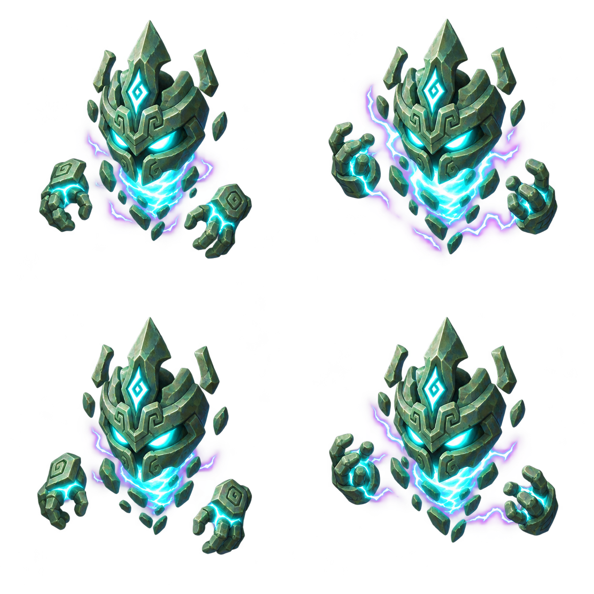
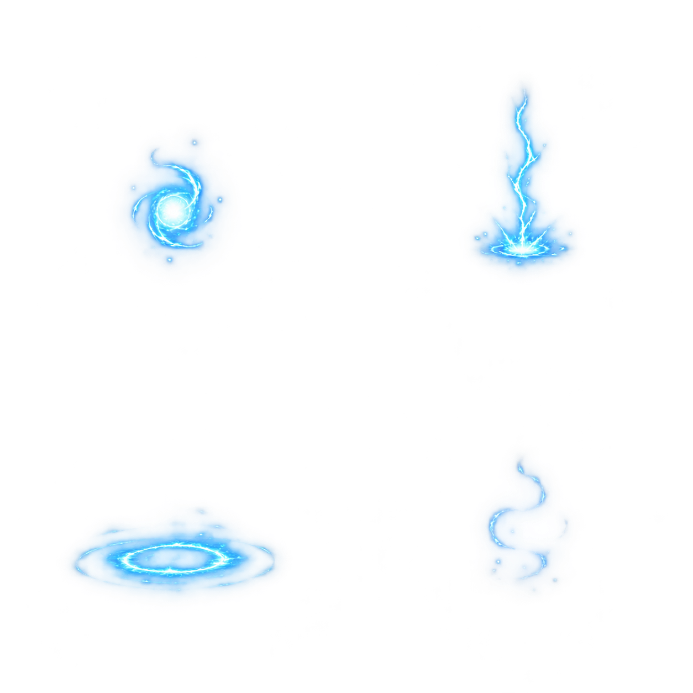

# 雷灵与雷击

[English](README.md) | 简体中文

Codex 创作源图，Forge v0.4.0 加工动画 Pack、登记到项目资源库，再交付原生资源到
Godot 4.6.3。[6.6 秒回放](godot-demo.mp4)展示这些资源在独立演示场景中的实际运行，
并非 Sword 游戏实录或 Forge 界面。README 顶部的 [GIF](godot-demo.gif) 是该实录的
无声缩小片段。

## 原始图集

以下 PNG 保留原始尺寸和文件字节，每张包含 2 × 2 排列的四帧。
提示词记录生成时的要求，不表示生成结果完全满足了每一项描述。

### 雷灵

[待机 PNG](sources/thunder-idle.png) · [移动 PNG](sources/thunder-move.png) ·
[待机提示词](sources/idle-prompt.txt) · [移动提示词](sources/move-prompt.txt)

Forge 保留图集的共享绘制坐标与透明度，将待机、移动分别设为 5 FPS 和 7 FPS，
每个循环均为四帧。雷灵属于演示原型（`prototype_usable`），首次加工时即明确使用
`requireGameReady:false`。动作相似和帧间变化仍然存在，不能视为已经验收的正式角色动画。

### 雷击

[原始 PNG](sources/lightning.png) · [Forge 使用的清理后 PNG](sources/lightning-clean.png) ·
[生成提示词](sources/lightning-prompt-v2.txt)

序列包含蓄力、落雷、冲击波和消散。封装 Pack 前，通过 Forge 源图抠图处理的一像素
光晕清理去除边缘噪点，随后通过了保持不变的 `requireGameReady:true` 检查。
这是技术验证，不等于人工美术验收。首次被淘汰的生成图不在本次公开素材中。

## 回放展示的流程

- Codex 生成怪物、特效和场景源图，并编写演示代码。
- Forge 加工、验证两个 Pack，登记产物，并向 Godot 安装原生 SpriteFrames 和场景；
  这些本地 Job 没有发起 Provider 请求。
- Godot 负责移动、瞄准、血条和受击闪烁。这些是游戏代码行为，不是额外生成的动画帧。

片段取自已有的 18 秒 Godot Movie Maker 实录第 1.0–7.6 秒。
MP4 为 960 × 540、30 FPS、无音轨；GIF 为 960 × 540、15 FPS、循环播放。
没有添加字幕、装饰边框、变速或插帧。GIF 循环的是实录片段，游戏状态并非无缝循环。

[provenance.json](provenance.json) 记录源文件和产物哈希、工具身份、Job ID 及此前的加工结果，
不包含原始任务库和本机路径。本次 README 更新复用已经完成的实录，没有重新生成素材，
也没有新增人工审核记录。Forge 免费开源，外部生成工具或账号可能另行收费。
