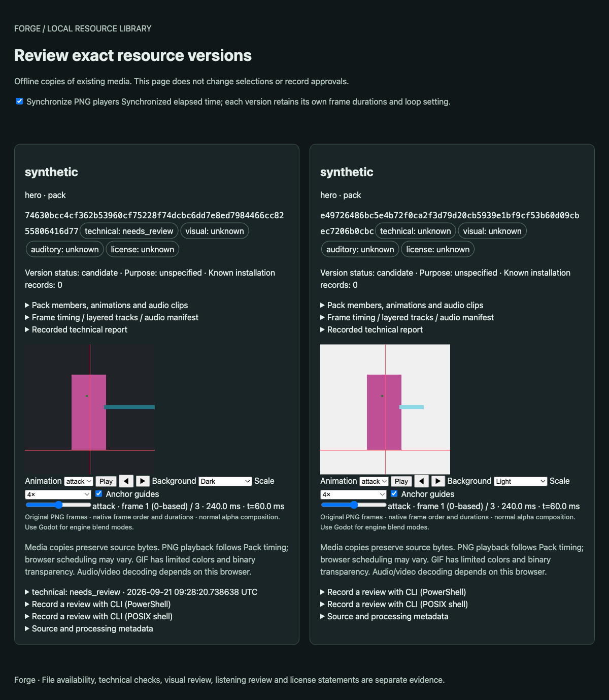

# Agent animation M2 — diagnosis, review and local revision

日期：2026-09-21。范围：默认特性源码；不发布版本，不表示动画美术已通过审核。
前置 main：`509791ba81d9179f06a5cab4bca9ce23d77372e5`，包含已合并 PR #59 / #60。

## 缺口与实施

| 能力 | M1 后状态 | M2 处理 |
| --- | --- | --- |
| 缺文件、非法规则网格、时长与共享画布 | 已有动作/帧/路径诊断 | 复用并加入闭环故障输入 |
| 空帧、触边、重复帧 | 已有像素测量，缺可直接定位的问题列表 | 在每动作 `pixelDiagnostics.issues` 中添加稳定类型、严重度、确定性、零起算帧索引、报告内 JSON pointer 及修正选项 |
| 位置/尺度/循环变化 | 已有测量和人工建议 | 保留测量；没有真实返工证据支持新的评分阈值，不新增身份/足部推断 |
| 原始 PNG 预览 | 已有逐帧/背景；不同版本独立计时 | 扩展现有离线页：默认原尺寸、缩放、锚点基准线、按共同毫秒时间同步多版本 |
| 单帧替换/显式时长修改 | 已有 request 字段可表达 | guide 提供新候选配方；不新增 patch 协议、命令或编排系统 |
| 新版本审核 | 已有精确 revision 与独立审核 | 验证新版本不继承旧记录，预览不写入批准 |
| blocked Job 接受 | 不导出，但误写 `accepted:true` 记录且返回成功 | 对本地动画在写审核文件前明确拒绝，保留原 Job 字节 |
| Godot 更新与恢复 | M1 已有原生像素/时序及事务验证 | 复用完整 Pack 安装，验证仅目标帧改变、游戏侧配置不变 |

English scope: M2 adds localized, actionable frame issues to existing reports and
synchronized original-PNG review to the existing offline library preview. A copied
request with an explicitly replaced input produces a fresh candidate, which is
revalidated and installed through existing transactions. Blocked local animations
cannot write a misleading acceptance record. This is technical evidence, not
artistic approval, a new generation service, or a release.

## 闭环验收

入口：`scripts/experiments/agent_animation_revision.py`。以 M0 素材构造有意停顿、
跳跃及越过画布的武器动作，分别植入缺失 PNG、非法网格、零时长、空帧。
这些是公开可复现的合成测试，不伪装成真实用户返工或模型生成结果。

1. 缺文件、网格和时长错误在 plan 阶段拒绝，消息包含 attack。
2. 空帧定位为 attack frame 1，`deterministic/error`；尝试接受必须失败，
   不新增审核文件、不改变原 Job。
3. 武器触边返回 `review_required/warning`，不把触边自动判定为裁切。
   已知裁切来自测试构造和独立目标图；重复姿势仅为信息，停顿/跳跃原样保留。
4. 原请求及素材保持不变，仅在新请求中选择 attack frame 1 的替换 PNG 和对应
   source lock。生成整 Pack 后，按动作验证只有这一帧改变，锚点及全部时序不变。
5. 同一库资产的旧 revision 保留审核，新 revision 审核为空；离线对比页不改库，
   像素副本与两个 Pack 一致，预览逐帧时长与 native manifest 一致。
6. 在同一个隔离 Godot 项目更新安装，以独立源 PNG 核验 SpriteFrames 的像素、
   帧序、锚点、逐帧时长、循环、seek 和完成状态；游戏脚本及 project.godot 不变。

可移植证据见 [verification.json](artifacts/agent-animation-m2/verification.json)。
保留失败尝试及后续修复；原始 Job、Plan、缓存和浏览器测试页面留在临时目录。
四组 macOS/Windows × Godot 4.6.3/4.7.2 CI 执行同一闭环及受控时钟测试，实际结果
以 PR checks 与上传产物为准。本地 macOS 通过不代表 Windows 已验证。

```sh
cargo fmt --all -- --check
cargo clippy --locked --workspace --all-targets -- -D warnings
cargo test --locked -p pack
cargo test --locked -p core --test animation_pixel_quality_tests --test animation_preview_tests --test animation_delivery_tests --test asset_library_review_tests
cargo test --locked -p forge-cli --bin forge
node scripts/test-animation-review-player.cjs
python3 scripts/test-cli-skill.py --forge FORGE --output NEW_GUIDE_OUTPUT
python3 scripts/experiments/agent_animation_revision.py --forge FORGE --godot GODOT --output NEW_REVISION_OUTPUT
```

`FORGE` / `GODOT` 必须为所选构建的绝对路径。受控 JS 时钟检查同步采样、原生不同
时长、停止/循环、拖动、切换动作、缩放/锚点；它不是浏览器布局或美术验收。
Node 仅用于开发测试，不是 CLI 运行时依赖。

Chromium 实际交互截图：两版定位到 attack frame 1、t=60ms，分别使用明暗背景、
4× nearest 显示和锚点线。这是预览功能核验，不是素材艺术审核。



## 边界

- `issues` 是可选的新增报告字段，新版本仍读取旧报告。旧工具的严格 schema 可能
  不认识新字段；消费端须显式选择工具链，不升级 pin 或改写历史回执。
- 本次故障与修正对象是规则输入；没有声明能推断未知帧序、补回缺失姿态或可靠识别
  未触边的内部裁切。位置/身份/足部一致性仍需观察，不能自动批准。
- 局部修改通过新 request 重建整个 Pack，复用既有校验和安装；不是原地修改 Pack，
  也不是局部缓存执行。固定网格修正须保留未修改单元，偏移需由 Agent 显式修正源图。
- 同步按毫秒，不强制相同帧号或拉伸周期。非循环版本停在终点；浏览器调度和默认
  alpha 合成不能代替 Godot 混合模式、实际背景及设备审核。
- 无模型调用、真实画风/动作自然度审核或生产力结论。M3/M4 保持待办。
