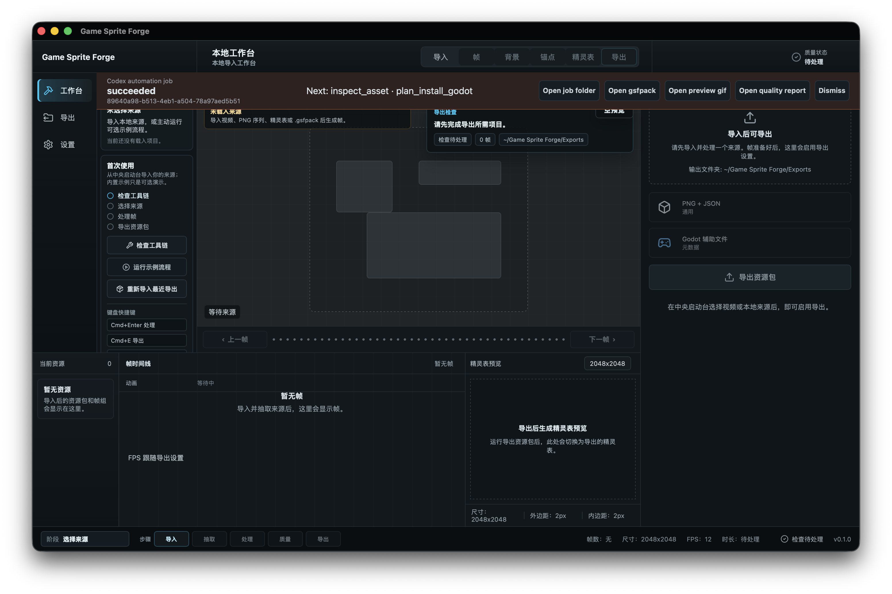

# Forge Automation V1 QA — 2026-07-31

## Scope

Validation of the Codex-first automation path added for PNG sequences, sprite sheets, `.gsfpack` reuse, durable background jobs, Godot 4 installation, and Forge GUI handoff. Multi-animation Character Packs remain out of V1.

## Environment

- Workspace: `/Users/kartz/Development/Forge`
- Workspace app bundle: `/Users/kartz/Development/Forge/target/debug/bundle/macos/Game Sprite Forge.app`
- Godot: `/Applications/Godot.app/Contents/MacOS/Godot` (`4.6.3.stable`)
- UI driver: workspace window capture via `scripts/capture-forge-ui-screenshot.mjs`, followed by direct visual inspection. The public `orca` CLI and equivalent session tool were unavailable.
- Asset fixture: `examples/inputs/manual-qa/png-sequence/frame_001.png` through `frame_006.png`
- Isolated stores/project: `/tmp/forge-automation-e2e.U9HzLA`

## Results

- `forge-cli doctor --json`: pass; resolved release CLI, versioned profile, Godot, and Forge app.
- PNG sequence `plan prepare-asset` → `plan execute --wait`: pass; six frames, `game_ready`, valid `.gsfpack`, preview, quality report, input fingerprint and recipe hash.
- Token reuse: pass; second execution rejected as already used.
- Detached worker: pass; initial `queued` job advanced to `succeeded` with durable artifacts.
- Godot install plan/execute: pass; generated texture, `forge_sprite_frames.tres`, `forge_animated_sprite.tscn`, and `.forge-owned.json` under `addons/forge_assets/cli_fixture`.
- Godot resource reload: pass; headless verification loaded the scene and found six `idle` frames.
- Ownership/path safety: pass; traversal, non-Forge-owned targets, unknown Character Pack fields, and symlink escape are rejected.
- Plugin/Skill validators: pass.
- Independent Skill forward-test: pass after closing four findings (symlink canonicalization, unknown multi-animation fields, Job field naming, packaged install reference).
- Workspace app handoff: pass; launching the bundle with `--forge-job-id 89640a98-b513-4eb1-a504-78a97aed5b51` displayed succeeded state, next actions, and artifact buttons.
- Browser-rendered UI smoke: pass (`smoke:ui:mvp`, en-US).

## Evidence

The banner is intentionally a recovery overlay: it does not hydrate automation output into the legacy manual workbench, and it gives direct access to the job folder, `.gsfpack`, preview, and quality evidence.
