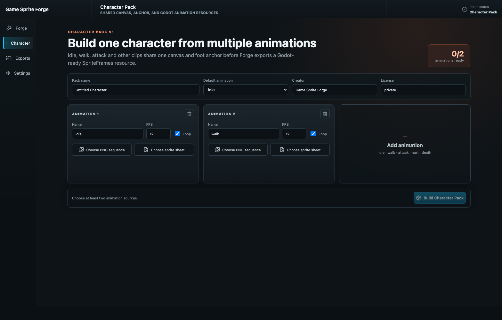
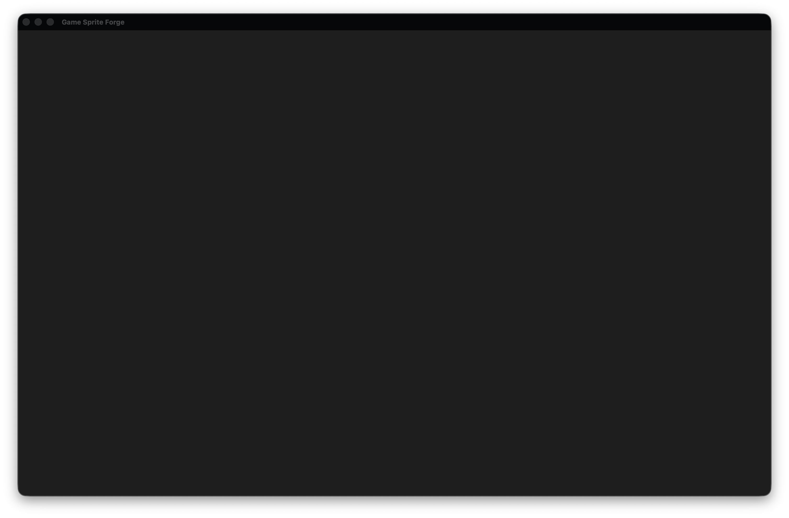

# Forge Character Pack V1 QA — 2026-08-02

## Scope

Validation of the schema V2 multi-animation path across the Rust core, JSON CLI, MCP bundle, Codex Skill, `.gsfpack` inspection, Godot 4 installation, and the dedicated macOS Character Pack workspace.

## Fixture and environment

- Input: `examples/inputs/manual-qa/png-sequence/frame_001.png` through `frame_006.png`, reused as two deterministic clips.
- Character job: `0db77f5a-4e61-412c-8e94-07c139131e5c` under `/tmp/forge-character-e2e.XUMZL4/jobs`.
- Pack: `/tmp/forge-character-e2e.XUMZL4/jobs/0db77f5a-4e61-412c-8e94-07c139131e5c/exports/345cacef-71c6-442b-9292-e793c861527a/CLI-Character.gsfpack`.
- Godot: `/Applications/Godot.app/Contents/MacOS/Godot` (`4.6.3.stable`).
- Workspace app: `/Users/kartz/Development/Forge/target/debug/bundle/macos/Game Sprite Forge.app`.

## Results

| Check | Result | Evidence |
| --- | --- | --- |
| CLI prepare/execute | Pass | Job succeeded with independent ingest/matting/quality steps, one shared normalization step, and pack export. |
| Pack inspection | Pass | Default `idle`; 12 total frames; `idle` = 6 frames at 8 FPS looping; `attack` = 6 frames at 12 FPS non-looping. |
| Quality/export | Pass | Aggregate plus per-animation reports and `preview.gif`, `previews/idle.gif`, `previews/attack.gif` were emitted. |
| Godot install | Pass | Install job `792e01b4-0005-4bf8-95af-278d106646e9` wrote Forge-owned resources below `addons/forge_assets/cli_character`. |
| Godot runtime verification | Pass | Headless verifier loaded the generated scene, selected `idle`, and confirmed both clips' frame counts, speeds, and loop flags. |
| Character Pack web smoke, en-US | Pass | `npm --workspace apps/mac run smoke:ui:character`. |
| Character Pack web smoke, zh-CN | Pass | `FORGE_SMOKE_LOCALE=zh-CN npm --workspace apps/mac run smoke:ui:character`. |
| Workspace debug app bundle | Pass | Signed `.app` built successfully; notarization skipped because credentials were not present. |
| Native Character Pack route/content | Pass | Launched the workspace bundle with `--forge-route character`; macOS Accessibility exposed the Character Pack title, localized navigation, metadata fields, both animation cards, source buttons, add-animation action, and build action. |
| Native window screenshot | Blocked | Window-level `screencapture -l` omitted the WebKit content layer for both the Character route and unchanged default route. Browser smoke supplies accepted visual evidence; the blank capture is retained only as screenshot-driver evidence, not treated as an app render failure. |
| Skill forward test | Pass | Independent read-only scenario selected schema V2, produced the correct two-plan tool sequence, and confirmed the refreshed plugin bundle exposes `plan_prepare_character_pack` at v0.2.0. |

## UI evidence

Accepted browser-rendered Character Pack screenshot:

Rejected native window capture (the Accessibility tree confirmed the content shown by the browser evidence was loaded):

## Boundaries confirmed

- The product GUI invokes the Rust plan/job/core path directly; it does not spawn the CLI or MCP server.
- CLI and MCP remain independent developer tooling and are not bundled into the app DMG.
- Character Pack V1 accepts raw PNG sequences and sprite sheets, not `.gsfpack` merging.
- Godot output remains engine-neutral: `SpriteFrames`, one `AnimatedSprite2D`, textures, and Forge ownership metadata; no gameplay controller is generated.
