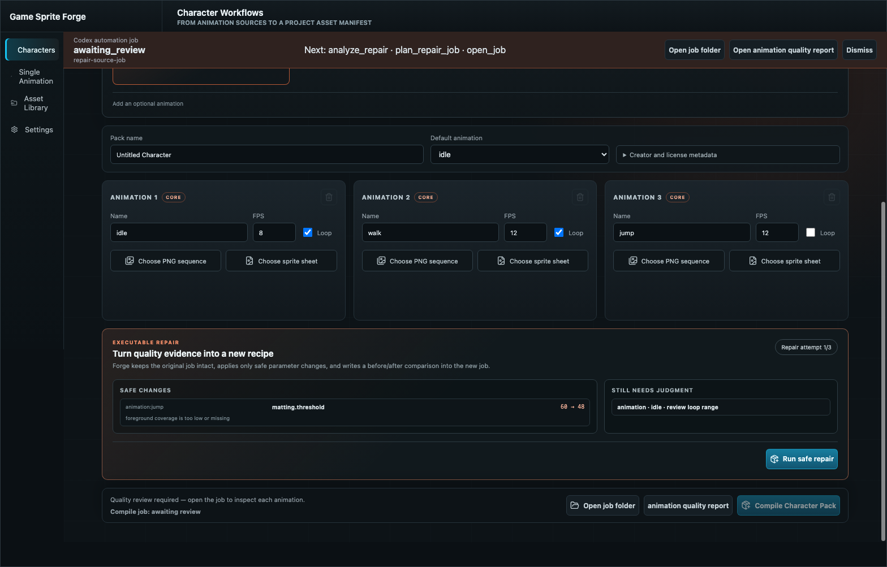
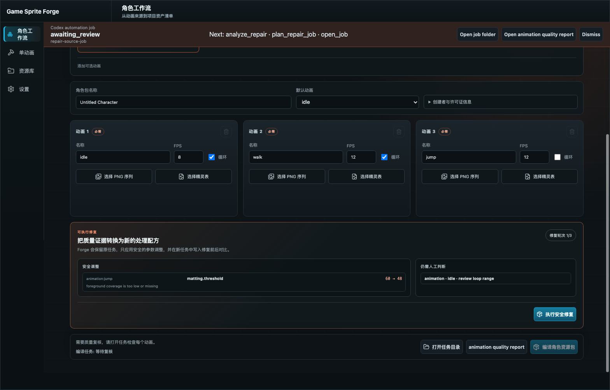

# Forge Executable Repair Loop V1 QA — 2026-08-02

## Scope

Validation of the bounded quality-repair loop across Rust core, durable jobs, CLI, MCP 0.4.0, Codex Skill, Character Workflows UI, repaired `.gsfpack` output, and Godot installation.

## Safety contract

- Analyze only `awaiting_review` prepare jobs with a reusable recipe and quality evidence.
- Preserve the source job; every execution creates a new job containing typed repair context.
- Show exact before/after values and plan effects before execution.
- Automatically change only existing chroma threshold, normalized canvas margin, or normalization mode.
- Keep loop range, clip length, background-mode selection, and unresolved anchor decisions manual.
- Permit one active repair child per source job and cap a repair chain at three attempts.
- Write `repair-comparison.json` after quality evaluation.
- Block Godot installation until a prepare or repair job reaches `succeeded` and its pack passes inspection.

## End-to-end fixture

- Temporary root: `/tmp/forge-repair-e2e.zH6L1A`
- Synthetic input: six 64×64 RGBA PNGs with green background and a near-green foreground rectangle.
- Failure recipe: auto-corners chroma threshold `60`, which removed the foreground.
- Safe repair: reduce only the affected animation's threshold from `60` to `48`.
- Godot: `/Applications/Godot.app/Contents/MacOS/Godot` (`4.6.3.stable`).

## Results

| Check | Result | Evidence |
| --- | --- | --- |
| Single-animation failure | Pass | Source job `a210c627-c340-400b-989d-0f6ad61edafd` reached `awaiting_review` with `blocked`, zero foreground coverage, and `reduce_chroma_threshold`. |
| Single-animation repair | Pass | Repair job `b6282f5a-e5f7-4cf9-8d89-bc411311331b` changed `60 → 48`, reached `game_ready`, and emitted `repair_comparison`. |
| Character failure | Pass | Source job `f28bc4fb-f483-4c04-b532-7ef68013fd13` kept `idle` game-ready while `attack` was blocked. |
| Scoped Character repair | Pass | Repair job `db03db50-e3d8-47ea-b6e4-e3f73ce1933e` changed only `animation:attack`, preserved `idle`, exported both clips, and reached `succeeded`. |
| Source immutability | Pass | Source recipes retain threshold `60`; repaired recipes contain threshold `48` in new jobs. |
| Comparison evidence | Pass | Before verdict `blocked`; after verdict `game_ready`; alpha coverage recovered; empty-foreground note/recommendation cleared; exact change, both reports, and preview retained. The boolean `improved` was not used alone. |
| Repair lineage | Pass | Unit tests reject another active repair child from the same source and enforce the three-attempt cap. |
| Manual boundary | Pass | Unit tests keep loop trimming and shorter-frame selection in `manualActions`; no automatic plan is produced when only semantic decisions remain. |
| MCP package | Pass | v0.4.0 exposes `analyze_repair` and `plan_repair_job`, with correct CLI routing and bundle tests. |
| Character repair UI, en-US | Pass | Mocked Tauri job/analysis smoke renders before/after values, manual actions, attempt counter, and disabled/primary state rules. |
| Character repair UI, zh-CN | Pass | Localized repair-state visible-text and screenshot assertions pass. |
| Native macOS startup | Pass | The signed debug `.app` opened a real native window, selected the Character Workflow route, and loaded source job `f28bc4fb-f483-4c04-b532-7ef68013fd13` as `awaiting_review` with repair next actions. |
| Godot installation | Pass | Repaired Character Pack installed as `repair_character`; manifest identifies `kind: character`, `idle` looping at 8 FPS, and `attack` non-looping at 12 FPS. |
| Godot project load | Pass | Headless Godot editor loaded the project and repaired asset resources without parse errors. |

Full regression passed with `cargo fmt --check`, `cargo test --workspace`, `npm run test:automation`, `npm run test:scripts`, the MVP/Character/repair UI smoke suites, both repair locales, MCP/plugin validators, and `tauri build --debug --bundles app`. The debug app bundle was signed locally; notarization was not attempted because notarization credentials were not supplied.

## Evidence

- [Before quality report](artifacts/forge-repair-loop-character-before-2026-08-02.json)
- [After quality report](artifacts/forge-repair-loop-character-after-2026-08-02.json)
- [Repair comparison](artifacts/forge-repair-loop-character-comparison-2026-08-02.json)

English repair workspace:

Chinese repair workspace:

## Remaining boundary

Repair V1 deliberately does not pick a loop range, discard frames, infer a new background-removal mode, or generate gameplay logic. Those choices can change animation meaning and remain explicit human/Codex decisions followed by a normal new plan.

Automatic repair jobs have typed lineage. A manual replacement request prepared after `open_job` is a normal unlinked V1/V2 job in this release; the Skill therefore requires the originating job ID in the handoff/report. A future schema can make this manual branch first-class lineage without weakening the semantic review boundary.
