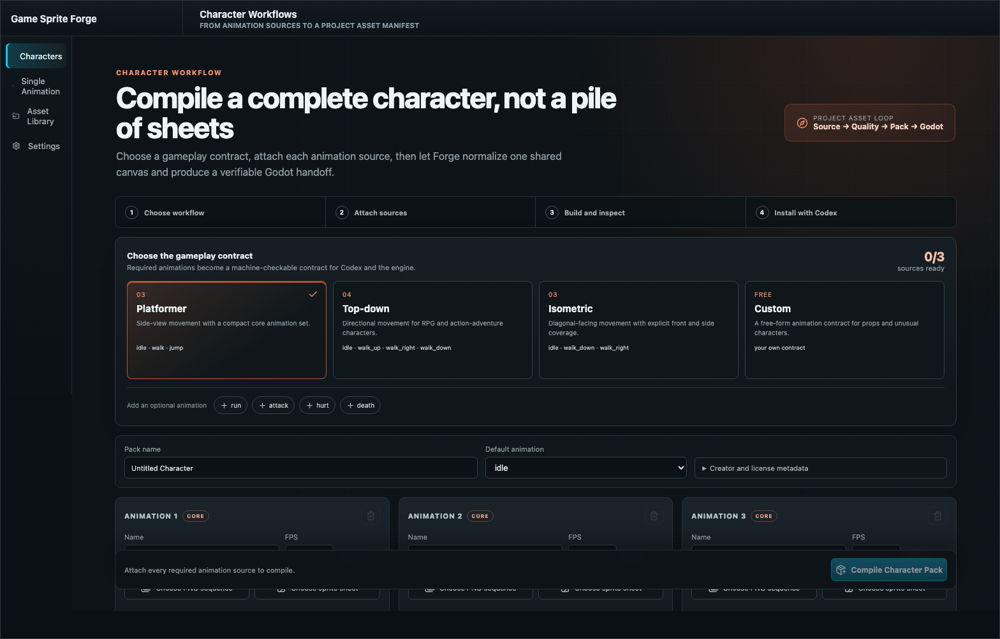
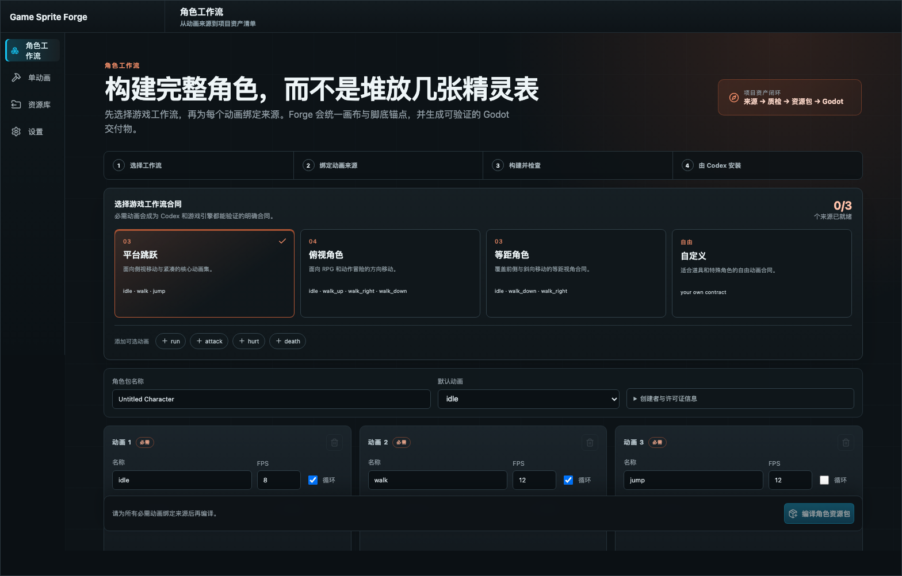

# Forge Project Asset Loop QA — 2026-08-02

## Scope

Validation of the SpriteCook-inspired project asset loop: versioned Character Workflows, Codex/MCP discovery, stable Godot asset identity, provider provenance, content-aware revisions, the redesigned Character UI, and backward compatibility with the single-animation workbench.

## Result summary

| Check | Result | Evidence |
| --- | --- | --- |
| Rust workspace | Pass | `cargo test --workspace`: core, pack, CLI, Tauri, sample pipelines, and all integration tests passed. |
| Character Workflow validation | Pass | Platformer rejects missing `jump`; catalog exposes Platformer, Top-down, Isometric, and Custom at version `1.0.0`. |
| Project manifest unit tests | Pass | Stable key deduplication, content-hash revision changes, and symlinked `.forge` rejection passed. |
| MCP package | Pass | v0.3.0 bundle exposes `list_character_workflows` and `inspect_project`; build, TypeScript check, and two bundle tests passed. |
| Plugin and Skill | Pass | Plugin validator and Skill quick validator passed; independent forward test confirmed the packaged bundle can execute the documented workflow. |
| Godot installation | Pass | Godot 4.6.3 installed the pack below `addons/forge_assets/knight` and emitted scene, `SpriteFrames`, ownership marker, usage contract, and project manifest artifacts. |
| Godot project load | Pass | Headless editor opened the generated project and parsed the installed resources without resource errors. |
| Stable revision | Pass | Identical content under asset key `knight` retained its revision; a newly introduced content SHA-256 correctly produced one migration revision, and the next identical install remained stable. |
| Provider provenance | Pass | The test SpriteCook provider/asset ID pair was preserved in `.forge/assets.json`; no credentials or remote URLs are stored. |
| Character UI smoke, en-US | Pass | Production build visible-text assertions and 1568×1003 screenshot passed. |
| Character UI smoke, zh-CN | Pass | Localized visible-text assertions and 1568×1003 screenshot passed. |
| Legacy single-animation smoke | Pass | The existing import-first workbench passed after Character Workflows became the default route. |
| Workspace debug `.app` build | Pass | Signed debug app bundle built successfully; notarization was skipped because credentials were not available. |
| Native window observation | Blocked | The current desktop automation session launched the workspace process but exposed no inspectable macOS window. Browser production-build screenshots are the accepted visual evidence; this is not counted as a native UI pass. |

## End-to-end fixture

- Temporary root: `/tmp/forge-project-loop-e2e.ByPS09`
- Pack: `Godot-Smoke-Walk.gsfpack`, 8 frames, 12 FPS, looping
- Project: `godot-project/project.godot`
- Stable asset key: `knight`
- Godot target: `addons/forge_assets/knight`
- Provider reference: `spritecook / spritecook-demo-knight`
- Content SHA-256: `ae7fc0d23a812967de9cc74a701052f29c3ffe18232fda7f1212ab31d6832123`
- Final successful install job: `432c5ac4-c6df-417d-8e72-03c55fd7e2aa`

The project manifest and usage contract retained as evidence are:

- [Project asset manifest](artifacts/forge-project-asset-loop-manifest-2026-08-02.json)
- [Godot usage contract](artifacts/forge-project-asset-loop-usage-2026-08-02.json)

## UI evidence

English Character Workflows:

Chinese Character Workflows:

## Product boundaries confirmed

- Character Workflows are the primary guided path; the existing single-animation flow, library, and settings remain available.
- Creator/license metadata is advanced disclosure rather than primary task UI.
- Forge installs neutral `SpriteFrames` and `AnimatedSprite2D` resources; it intentionally does not generate gameplay controllers.
- CLI and MCP remain independent developer tooling; the product GUI calls the same Rust core directly.
- Provider references store identity only. SpriteCook tokens, signed URLs, and secrets are excluded.
- Tilesets and executable automatic repair remain later phases rather than being mixed into this delivery.
