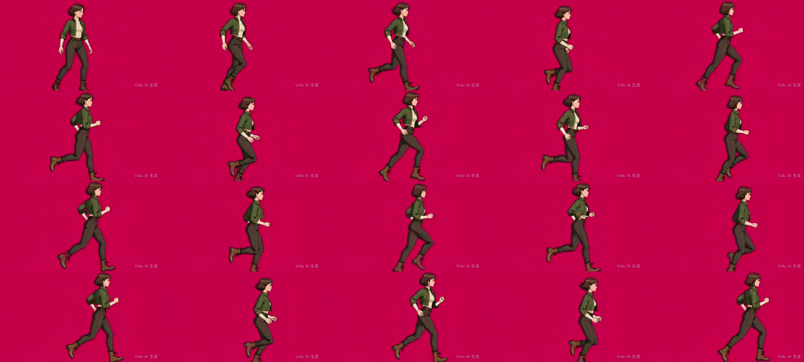
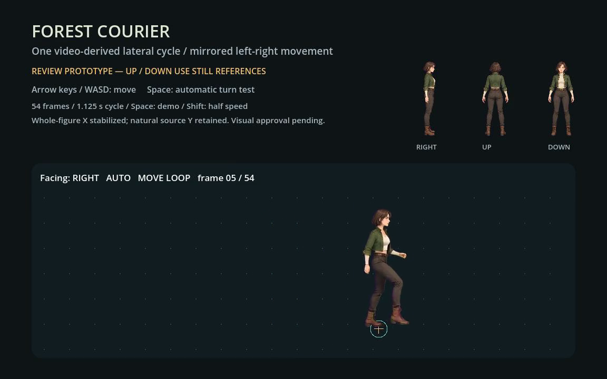

# Three-view movement review — 2026-09-26

Status: **source action rejected by user; requested running animation incomplete**.

The user reported that the original Vidu video does not run. Reinspection of
chronological frames supports a slow stepping/walking-like action rather than
convincing sustained running. The previous 2× playback and Godot translation
cannot establish source gait quality. Keep the candidate and passing technical
tests as evidence only; select a new source at original playback speed before
preparing another run animation. No additional generation was submitted.

The [runnable example](../../examples/three-view-run-pilot/README.md) contains one
new character's side/back/front references from one built-in image-generation
call and a native Godot static direction preflight. The later video-derived lateral movement candidate is now installed and tested.
Up/down remain static references.

## Completed evidence

- One three-view source generated; character appearance inspected by the agent.
- Forge matte processing inspected on dark/light backgrounds. The first candidate
  retained magenta hair edges; the second reduced them. Fine-edge visual review
  remains pending.
- Three static runtime textures prepared and installed by Forge; local Pack
  validation and installation verification passed with zero Forge Provider calls.
- Godot 4.7.2 native MovieWriter rendered 241 frames at 30 fps. The measured
  480-physics-tick test visited all four directions twice, retained foot origins
  across turns and kept collision transforms unchanged. Maximum measured velocity
  error was approximately 0.000003815 px/s at 60 px/s.
- Native screenshot reviewed; user artwork approval is pending. A clean-copy
  check validates that the committed fixture runs without private stores/caches.

## Verification and build identity

The media pipeline used the installed Forge 0.6.3 release, not a build of this PR:

- Commit: `546bcefaf145b32f6d5f27b1e509a93b071037f8`, clean, no optional features.
- Target/profile: `aarch64-apple-darwin`, release.
- Binary SHA-256: `618cdad7ef1981cf046852baad1a34c5e435847ab2ab2356a6eeb51cf5a5e342`.
- Native Godot: `4.7.2.stable.official.ed1daf0bf`, macOS Apple M4.
- Preparation Job: `2824bb5b-bcad-4884-b5e6-b6fc58ea456d`.
- Installation Job: `52508e0f-c24c-41d7-bed8-4c52e71e7712`.

Commands used: `doctor --json`, `guide static`, `source matte`,
`plan prepare-static`, `plan execute --wait`, `job report`, `pack validate`,
`godot plan-install`, and `godot verify-install`. Stores, original media,
requests, CLI reports and the native recording remain in local task storage.
The [compact summary](artifacts/three-view-run-pilot-20260926/summary.json) binds
source, runtime texture and movie hashes. The [runtime report](artifacts/three-view-run-pilot-20260926/direction-report.json)
records the checks and explicitly sets `run_animation_tested:false`.

## First video attempt (retained rejection)

The original Q2 image-to-video form could not submit with balance 1. The user
then selected Q2 Pro's one free use. An existing three-view subject, “林间信使”,
was used for one 5-second, 1080p, H265 reference-to-video request at 0 credits.
Task `3482790844721311`, creation `3482790851026363` completed. The subject task
then offered “领取奖励”; after claiming it the task showed completed and the
balance was 21, up from 1. No additional paid request was submitted.

The downloaded source is 1920×1080, 24 fps, 121 frames, 5.041667 seconds.
Full-clip contact sampling and consecutive source frames 48–71 show boots cut by
the source bottom edge during repeated running poses. This source is rejected
for sprite extraction; missing feet will not be reconstructed by warping limbs.
The actual background is red-magenta, not uniform #FF00FF. A normal source file
and 0.5× preview remain local. [Review and source hash](artifacts/three-view-run-pilot-20260926/q2-pro-review.json).

## Second video and animated turning

One authorized Q2 image-to-video request used the side reference on a padded
canvas, 5 seconds, 1080p selection, H265 and 闪电出片. It cost 10 credits;
the observed balance changed from 21 to 11. Task `3482958885594851`, creation
`3482958893141977` completed. Actual output: 1764×1176, 24 fps, 122 frames,
5.083333 seconds. Source hashes, prompt/input hashes and credit evidence are
recorded in the compact summary. No automatic retry followed.

Source frames 47–100 form the candidate full support-exchange cycle; frame 101
is the same-phase boundary comparison and is omitted. A common 800×800 crop
excludes the remote watermark while keeping full boots. Forge mattes use sampled
border key colors, threshold 120, softness 50, zero despill and edge recovery.
These are source-specific settings. [Dark/light matte sample](artifacts/three-view-run-pilot-20260926/matte-review.jpg).

Whole-figure horizontal offsets range from -41 to 87 source pixels; all source Y
coordinates and joint relationships are preserved. After a common 0.5 scale,
frames are 400×400 with pivot (200,360). Exact hashes and offsets are in the
[cycle manifest](artifacts/three-view-run-pilot-20260926/cycle-manifest.json).
The review cadence is 2× the original source: 54 frames, 1125 ms per cycle.
No interior frame is removed and no missing pose is synthesized.

Strict GameReady preparation Job `cd3a1810-395e-421d-ac4d-5ab806b4bc40` remains
`awaiting_review` with `prototype_usable`, not GameReady. Metrics: bottom drift
9 px, center-X variation 64.5 px, center-Y variation 11 px, loop-match 0.89246.
A distinct request for this review prototype exported the unchanged sequence:
Job `d5bfc886-3876-42fa-bbf9-2d919f630f02` succeeded. Pack validation passed.
Install Job `58567e91-abad-451d-bd52-ec9bbe324ecf` succeeded; read-only install
verification checked 11 files, 3 textures and 6 cache files. Native loading was
then exercised separately below. All Forge operations made zero Provider calls.

The real Godot CharacterBody2D runs at 180 px/s horizontally (45 vertically),
with scale 0.7, pivot (200,360) and collision radius 16. Up/down switch to static
references; the lateral clock is frozen while those are shown. Mirroring affects
only the visual parent and never restarts the cycle.

- [Normal native report](artifacts/three-view-run-pilot-20260926/animated-turn-normal.json):
  786 ticks, 54 unique frames, 9 completed cycles, every turn preserves phase,
  anchors and collision; all timing/velocity checks pass.
- [Half-speed native report](artifacts/three-view-run-pilot-20260926/animated-turn-slow.json):
  786 ticks, 54 unique frames, 4 completed cycles; all checks pass.
- [Clean-copy check](artifacts/three-view-run-pilot-20260926/animated-clean-copy-check.json):
  a fresh portable project without private caches or ownership records imports
  and passes the animated runtime test.

Both native movies contain 786 frames at 60 fps (13.1 seconds); MP4 derivatives
remain local. The screenshot below comes from the normal native recording.

The agent inspected full-clip contact samples, consecutive cycle frames, matte
samples and native recording samples. This is not user visual approval. Source
boot-color shimmer, fine edges, loop seam and foot contact remain review items.
There is no front/back locomotion or production-quality claim. The original
high-resolution media, full Pack/Job stores and local ownership/cache files stay
outside Git; only selected derived media and portable resources are committed.
