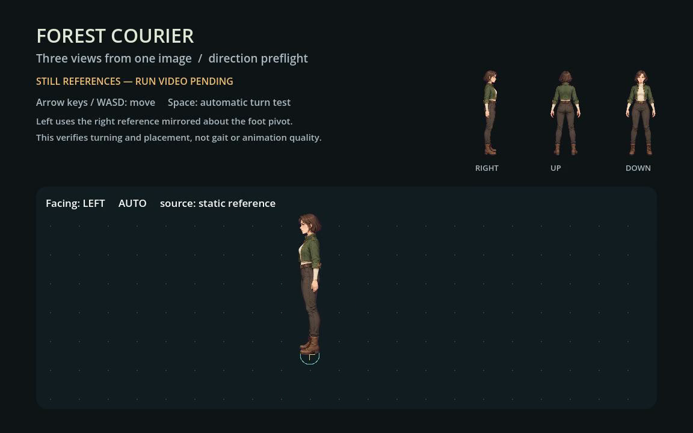

# Three-view direction preflight — 2026-09-26

Status: **partial; video generation blocked by Vidu credits**.

The [runnable example](../../examples/three-view-run-pilot/README.md) contains one
new character's side/back/front references from one built-in image-generation
call and a native Godot static direction preflight. This does not complete the
requested one-direction run animation.

## Completed evidence

- One three-view source generated; character appearance inspected by the agent.
- Forge matte processing inspected on dark/light backgrounds. The first candidate
  retained magenta hair edges; the second reduced them. Fine-edge visual review
  remains pending.
- Three static runtime textures prepared and installed by Forge; local Pack
  validation and installation verification passed with zero Forge Provider calls.
- Godot 4.7.2 native MovieWriter rendered 241 frames at 30 fps. The measured
  480-physics-tick test visited all four directions twice, retained foot origins
  across turns and kept collision transforms unchanged. Maximum measured velocity
  error was approximately 0.000003815 px/s at 60 px/s.
- Native screenshot reviewed; user artwork approval is pending. A clean-copy
  check validates that the committed fixture runs without private stores/caches.

## Verification and build identity

The media pipeline used the installed Forge 0.6.3 release, not a build of this PR:

- Commit: `546bcefaf145b32f6d5f27b1e509a93b071037f8`, clean, no optional features.
- Target/profile: `aarch64-apple-darwin`, release.
- Binary SHA-256: `618cdad7ef1981cf046852baad1a34c5e435847ab2ab2356a6eeb51cf5a5e342`.
- Native Godot: `4.7.2.stable.official.ed1daf0bf`, macOS Apple M4.
- Preparation Job: `2824bb5b-bcad-4884-b5e6-b6fc58ea456d`.
- Installation Job: `52508e0f-c24c-41d7-bed8-4c52e71e7712`.

Commands used: `doctor --json`, `guide static`, `source matte`,
`plan prepare-static`, `plan execute --wait`, `job report`, `pack validate`,
`godot plan-install`, and `godot verify-install`. Stores, original media,
requests, CLI reports and the native recording remain in local task storage.
The [compact summary](artifacts/three-view-run-pilot-20260926/summary.json) binds
source, runtime texture and movie hashes. The [runtime report](artifacts/three-view-run-pilot-20260926/direction-report.json)
records the checks and explicitly sets `run_animation_tested:false`.

## Blocker and remaining work

Vidu Q2 image-to-video was configured with one side-reference image, one output,
5 seconds, 1080p, H265 and a concise sustained-run prompt. The page displayed
balance 1 and “积分不足 / 订阅套餐”; an exact payable cost was not displayed.
There was no submission, task ID, generated video or credit deduction.

Video generation, full-cycle selection, run-frame cleanup, Forge animation
delivery and animated left/right-turn verification remain outstanding. No old
video or synthetic gait was substituted. This case provides no new evidence for
front/back locomotion, weapon continuity or true overhead perspective.

Only selected derived media and portable runtime resources belong in Git.
Original high-resolution source media, complete Pack/Job stores, local ownership
records and `.godot` caches are excluded. Review this PR as a draft until the
requested video and animated-turn evidence are added.
