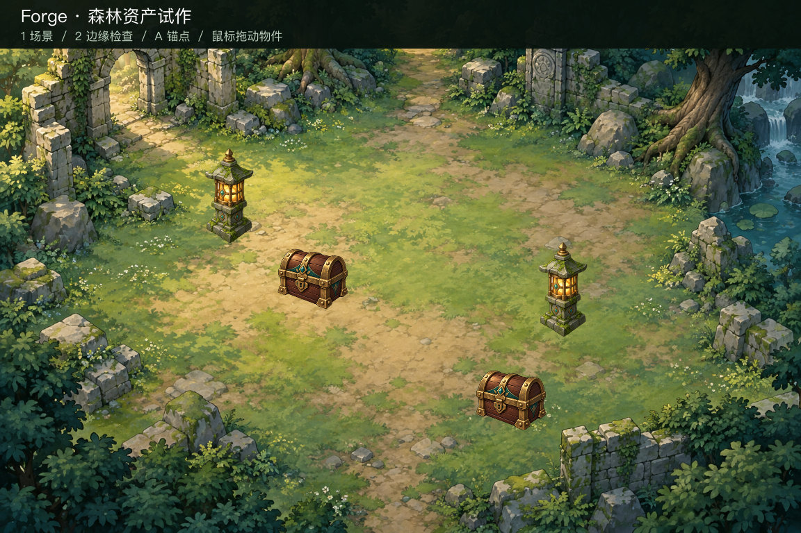

# Static forest scene: generated props and a full-frame background

A reusable template for turning AI-generated (or hand-drawn) 2D artwork into
Godot resources with Forge: one Pack of transparent props, one Pack holding an
opaque full-frame background, and a small review scene. It records the
conventions verified in the
[2026-10-02 static asset trial](../../docs/qa/forge-static-asset-trial-2026-10-02.md);
that trial's source art is not committed here.

## What is included

| Path | Purpose |
| --- | --- |
| `requests/props.json` | `prop_set` template: two transparent props on a 256 canvas, `foregroundAlphaThreshold: 8` |
| `requests/background.json` | `preserve_source` template: one opaque full-frame background, original pixels kept |
| `godot-review/` | Minimal Godot 4.7 project that loads the installed Packs for visual review |
| `previews/` | Captures from the trial run: composed scene and light/dark size check |

## Use it with your own artwork

1. Create one transparent PNG per prop and one opaque PNG for the background
   (Codex imagegen, another tool, or hand-drawn). Put them in a `sources/`
   directory next to the request files.
2. Run `forge source inspect --path sources/NAME.png --preview-dir NEW_DIR --json`
   for each source. If the threshold-1 bounds are much larger than the
   threshold-8/32 bounds, the file has faint stray pixels; review the previews
   and choose the lowest threshold whose bounds match the real subject. The
   props template already uses `8`, the value the trial selected for two
   generated transparent props.
3. After visual review, add `sourceLocks` with the reviewed SHA-256 hashes,
   then `plan prepare-static`, `plan execute`, `pack validate` and
   `asset inspect` each request. This route makes zero Provider requests.
4. Install with stable keys and targets:
   `forge godot plan-install --pack PROPS_PACK --project GAME --asset-key forest_props --target addons/forge_assets/forest_props`
   (and the same pattern with `forest_background` for the background Pack).
5. Open `godot-review/` (or copy `main.gd` into your game). Key 1 shows the
   composed scene, key 2 a light/dark edge and size check, A toggles anchor
   markers; props can be dragged for layout experiments, and dragging is not
   saved.

## Conventions this example records

- Canvas size is not world size. Both props share a 256 canvas, but the review
  scene draws the chest at scale 0.48 and the lantern at 0.65. Keep per-instance
  scale, ground position and size in the game scene or a wrapper, not in Forge.
- Updating art keeps the layout: prepare a new Pack with the same set/item IDs
  and install it to the same asset key and target. Forge-owned resources update
  in place; the scene file is untouched. A receipt exported before the update
  then reports `installation baseline differs from receipt` — export a fresh
  receipt after each accepted update and keep the old one.
- The background is one complete scene image, not a tile set. Collision,
  navigation and walkable areas are game work outside these Packs.
- Visual review is separate from technical validation: `game_ready` Packs and
  verified installs do not grant artistic approval.

**中文：** 本示例是可复用模板：一组透明道具 Pack 加一张完整背景 Pack，配套
Godot 预览场景。先检查源图的多阈值取边范围再选 `foregroundAlphaThreshold`；道具的
实际大小由场景中的缩放决定，替换素材时保持资产 ID、asset key 和安装目标不变即可原地
更新，更新后导出新收据并保留旧收据。本目录不提交试作源图，预览图来自
2026-10-02 的验证记录。
