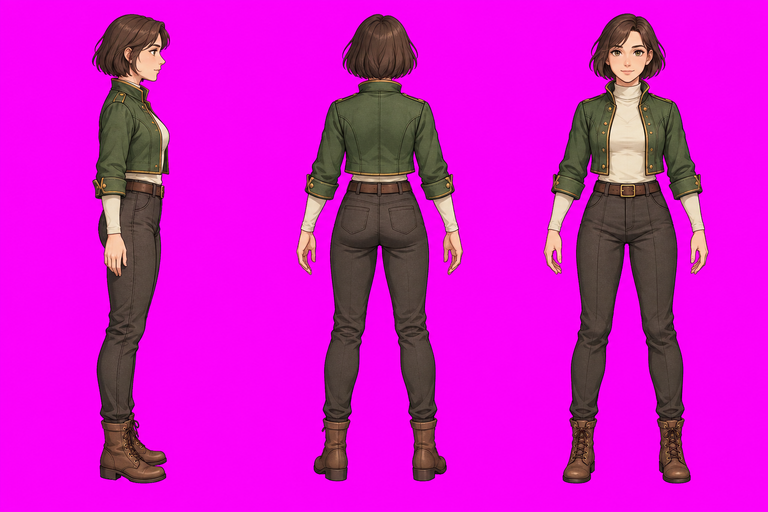

# Three-view character pilot / 三视图角色试验

**Draft: three views and static direction preflight are complete.** One Q2 Pro
subject-reference video was generated using its free trial (0 credits). The
20-credit subject task reward was claimed; the observed balance changed from
1 to 21. The video is retained but rejected for sprite extraction because boots
are cropped at the source bottom edge during running poses.

**草稿：三视图与静态转向预检已完成，已免费生成一段 Q2 Pro 主体参考视频。**
主体任务奖励 20 积分已领取，余额从 1 变为 21。视频部分跑动姿势的靴子被
画面下沿裁切，尚未获得可交付的完整跑动循环；Godot 当前仍是静态转向预检。



## Run the preflight

Open `godot/project.godot` in Godot 4.7.2, or from the repository root:

```sh
godot --path examples/three-view-run-pilot/godot --editor --import --quit
godot --path examples/three-view-run-pilot/godot
```

Use arrow keys or WASD to move; Space toggles the automatic turn test.
Right/up/down use separate static reference images. Left mirrors the right
image around its registered foot origin. Only the visual parent is mirrored;
the CharacterBody2D and collision shape keep their transforms.

To repeat the measured 480-physics-tick test:

```sh
godot --headless --path examples/three-view-run-pilot/godot -- \
  --test --report=/absolute/new-direction-report.json
```

Use a new report path. The report distinguishes direction mechanics from the
unperformed animation test (`run_animation_tested:false`). The script exits
nonzero for a failed check or unwritable report. For visual review, run the same
test without `--headless`, optionally with Godot's `--write-movie` argument.

## Source and processing

One built-in Codex image-generation call produced the same character in right,
back and front standing views. The complete 1536×1024 source remains in local
task storage; this folder contains a selected 768×512 preview and the prompts.
The source hash and derivation details are in the [QA summary](../../docs/qa/artifacts/three-view-run-pilot-20260926/summary.json).

Three 512×1024 column crops were processed with the selected installed Forge
CLI's `source matte`. A common 0.5 scale produced three 256×512 runtime sources.
Forge `plan prepare-static`, Pack validation, `godot plan-install`, and
`godot verify-install` completed with zero Forge Provider requests. The committed
PNG resources, import settings, scenes and usage guide are a portable snapshot
of that installation. Machine-specific ownership records, stores and caches
are excluded. Treat this checkout as a runnable review fixture; use a fresh
project and the retained local Pack/receipts for another managed Forge install.

The nearly eye-level references are not a verified overhead projection. Fine
hair-edge color remains a visual-review item. Horizontal mirroring is suitable
for this empty-handed, mostly symmetric design; it does not establish that a
weapon-bearing or asymmetric character may be mirrored without changes.

## Complete the one-direction animation

1. Retain the first Q2 Pro candidate and its [review](../../docs/qa/artifacts/three-view-run-pilot-20260926/q2-pro-review.json).
   Its exact subject-reference prompt is [video-prompt-q2-pro.txt](video-prompt-q2-pro.txt).
   A later authorized candidate should leave clear head/foot margins and make the
   character smaller in the frame. Verify the live cost before another submission;
   the one free request is used. No automatic paid retry was made.
2. Inspect the complete generated video, select a full run cycle, and retain
   source timestamps, frame indices, hashes and any reviewed timing edits.
3. Matte the selected sequence, preserve natural motion and compare normal/slow
   playback plus the repeated seam. Keep generation and local processing distinct.
4. Prepare the animation with Forge using a common canvas/pivot and explicit
   durations. Install it into a separate animation target in Godot.
5. Replace lateral still movement with the reviewed run resource, mirror it for
   left, and test phase continuity and placement during repeated left/right
   turns. Up/down remain static references until their own videos are generated.

The new run's actual speed, scale, duration and pivot must be reviewed together;
this static preflight's 60 px/s and 0.5 display scale are not run presets.
